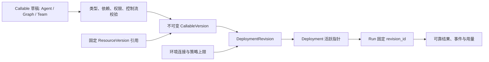
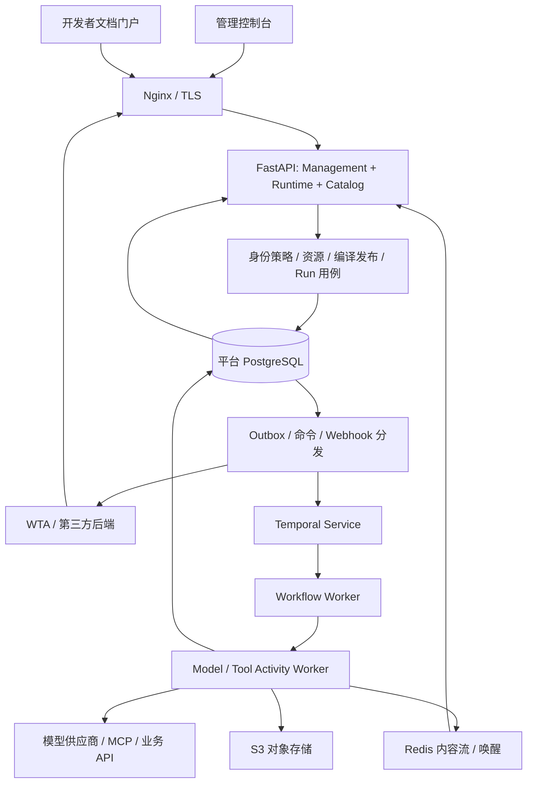
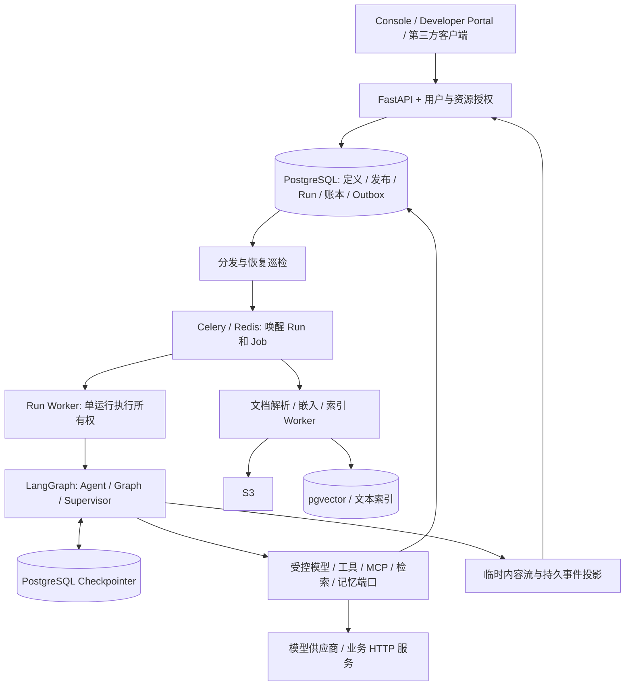

# wta-ai 设计访谈与方案记录

G 初始化与设计访谈已完成，用户已确认整体共识（LOG-050）；设计树全部 21 个节点已有回答，状态为 consensus。已确认要求进入 ADR/CONTEXT；完整推荐方案与待确认选项留在本记录。原设计是输入，不是实现证据。

**项目归属更新：** LOG-051 / ADR-021 将项目迁至独立 wta-ai 仓库，替代所有历史同仓路径与 WTA 发布清单要求。LOG-001～050 保留访谈历史；其中非本 change 的项目路径属于原 WTA-plus 仓库，定位规则见 <Path>{roots.state}/specdev/changes/2026-09-19-go-python-ai-platform/evidence/project-migration.md</Path>。

**当前阅读入口：** 技术基线由 LOG-029 / ADR-005～007 确认：Python/FastAPI + LangGraph + PostgreSQL/pgvector + Celery/Redis + Docling + Vue/Vue Flow/Scalar；P0 含完整 RAG、记忆与高级扩展。第三轮最新合同见 LOG-036～042 / ADR-011～016：分类保留默认至主动删除、Docker Compose 单机私有化先实测、超管管理和密钥分发、暂不建设第三方专门身份/审批集成、硬预算/发布门禁、逐 token 持久化完整重放、双 v1 HTTP 合同。ADR-013 替代 ADR-004/010 的普通用户私有资源和门户用户登录模型；无租户、独立平台、双前端和双 API 不变。LOG-026/027 中用户 ACL/角色、第三方集成应用和默认记忆 TTL 不再是当前提案；第四轮决定见 LOG-044～046 / ADR-017～019：完整 RAG、记忆增加外部业务用户隔离、远程 MCP 与超管本地审批已确认。可信业务后端传入记忆标识及写入政策已由 LOG-048 / ADR-020 确认。完整方案摘要见 LOG-049，整体共识确认见 LOG-050；无尚未回答的设计节点，下一 Work 为 S-spec，尚未自动执行。LOG-005～035 是历史方案与决定，Temporal、多租户、能力延期、默认到期删除及临时 token 流均不得作为现行合同。

## LOG-001 — 2026-09-20 — 恢复 G 与证据边界
- **设计树节点：** 不适用
- **轮次与依赖：** round 0 / 无
- **状态：** confirmed
- **问题：** 是否恢复原来暂缓的 change，当前授权到哪一步？
- **事实与来源：** 用户本轮明确要求激活 <Path>{roots.workflows}/specdev/G-grill-with-docs/G-grill-with-docs.md</Path>，学习成熟平台，并初始化本 change 的 LOG、ADR、CONTEXT。输入为 <Path>temp/wta-ai-platform-design/</Path>；冻结来源为 <Path>{roots.state}/specdev/changes/2026-09-19-go-python-ai-platform/source.md</Path>。
- **选项：** 继续暂缓 / 恢复设计 / 直接实现。
- **推荐：** 恢复设计并建立可恢复设计树。
- **结论：** 本轮恢复本地设计工作；旧“用户暂缓”不再是当前阻塞。用户允许调整原文档与技术栈；旧 Issue 标题中的 Go/Python 不是新的硬限制。
- **原因：** 用户最新请求优先于旧暂停指令。
- **影响工件：** LOG / CONTEXT / ADR / design tree / change status / worklog。
- **约束或不变量：** 不改原始来源快照、旧设计输入、永久知识或产品代码；不自动创建 Ready Spec、Tickets、Goal、实现提交或远程写入。
- **后续：** 本地研究、方案与访谈由 codex-root 负责；未决高影响选项保留 open。
- **替代/被替代：** 替代旧 worklog 的暂停状态，保留历史来源。

### 可复核输入

- 仓库核对基线：`2b4fd1f4b0e8f8c3520788f35a08476d5ecb0257`，2026-09-20；本轮开始时工作树干净。
- 原稿主文档：<Path>temp/wta-ai-platform-design/WTA-AI-Platform-Architecture.md</Path>，重点第 1、4–9、20–26 章；配套 <Path>temp/wta-ai-platform-design/specs/runtime.openapi.yaml</Path>、<Path>temp/wta-ai-platform-design/specs/001_core.sql</Path>。原稿自己声明没有实际联网或仓库核验，SQL 未在 PostgreSQL 执行；本轮不会把这些声明改成已验证。
- 实际 AI 现状：<Path>backend/wta-modules/wta-ai/README.md</Path>、<Path>backend/wta-common/wta-common-ai/README.md</Path> 均为 Maven 占位，旧数据保留且不迁移。
- 独立服务构建事实：<Path>backend/wta-extend/pom.xml</Path> 目前只有 Monitor/SnailJob；<Path>release-artifacts/scripts/release-state.py</Path> 和 <Path>release-artifacts/apps.json</Path> 尚未登记 AI 服务与两个 AI 前端。
- 工程硬约束：<Path>.agents/skills/engineering-standards/SKILL.md</Path>；数据库参考 <Path>.agents/skills/engineering-standards/references/rules/security-and-data.md</Path> SEC-004 与 <Path>{roots.state}/specdev/adr/0011-namewta-mysql-only-database-contract.md</Path>；HTTP 参考 <Path>.agents/skills/engineering-standards/references/rules/api-errors-resources.md</Path> API-005。

## LOG-002 — 2026-09-20 — 独立平台及源码归属
- **设计树节点：** D-001
- **轮次与依赖：** round 0 / 无
- **状态：** confirmed
- **问题：** 平台的产品和源码边界是什么？
- **事实与来源：** 用户明确要求在 <Path>backend/wta-extend/</Path> 建设 wta-ai-server，内部自有 frontend/backend，语言不限。
- **选项：** Java 宿主内置模块 / 同仓独立平台 / 外部独立仓库。
- **推荐：** 同仓独立平台。
- **结论：** 采用 <Path>backend/wta-extend/wta-ai-server/</Path> 作为完整平台根，WTA 是外部 API 消费方之一。
- **原因：** 符合独立运行与一站式开发要求。
- **影响工件：** ADR-001 / CONTEXT。
- **约束或不变量：** 不共享 WTA 业务持久化层；不因目录位置强套 Java 类型和 Maven 构建。
- **后续：** D-010 决定技术栈与 scoped 工程合同。
- **替代/被替代：** 无。

## LOG-003 — 2026-09-20 — 两个前端访问面
- **设计树节点：** D-002
- **轮次与依赖：** round 0 / D-001
- **状态：** confirmed
- **问题：** 平台需要哪些前端？
- **事实与来源：** 用户明确提出管理端与对外调用文档平台。
- **选项：** 仅管理台内附 Swagger / 管理台与专门开发者门户。
- **推荐：** 管理台与开发者门户。
- **结论：** 两个真实访问面均进入产品范围；具体工程拆分和公开级别不由此预设。
- **原因：** 管理者与外部调用者的任务、权限和导航不同。
- **影响工件：** ADR-002 / CONTEXT。
- **约束或不变量：** 门户不暴露生产凭据与内部资源定义。
- **后续：** D-010、D-011、D-023。
- **替代/被替代：** 无。

## LOG-004 — 2026-09-20 — 两套公开 API
- **设计树节点：** D-003
- **轮次与依赖：** round 0 / D-001
- **状态：** confirmed
- **问题：** 外部系统仅调用 Agent，还是也能管理平台？
- **事实与来源：** 用户明确要求第三方管理 OpenAPI，WTA-plus 后端可以接入并嵌入管理。
- **选项：** 仅运行 API / 运行与管理 API 同时公开。
- **推荐：** 两套公开合同，共用平台用例与授权规则。
- **结论：** 提供 Runtime API 与 Management API，不把 OpenAPI 误写成 OpenAI 协议。
- **原因：** 第三方需要稳定管理能力，不能依赖内部页面请求。
- **影响工件：** ADR-003 / CONTEXT。
- **约束或不变量：** 运行权限与管理权限分开定义。
- **后续：** D-012、D-022、D-023。
- **替代/被替代：** 无。

## LOG-005 — 2026-09-20 — 唯一推荐技术基线
- **设计树节点：** D-010
- **轮次与依赖：** round 1 / D-001、D-002、D-003
- **状态：** deferred
- **问题：** 是否采用以下明确技术组合，并为独立平台确立存储与工程规则作用域？
- **事实与来源：** 原稿第 5.4 节已经倾向 Python/FastAPI/Temporal/PostgreSQL；本仓主前端使用 Vue；本轮允许调整语言。外部原始资料与限制见本记录后续调研条目。
- **选项：** A：下表 Python 模块化平台；B：Go 控制/API + Python Worker，增加跨语言合同和部署；C：直接 fork 现有平台，接受其领域、许可及升级约束。
- **推荐：** A。避免在缺乏网关瓶颈证据时增加 Go，自有领域合同保持可演进。
- **结论：** 下表是本轮唯一推荐方案，尚未被用户接受为架构合同；不是“任意选一个”的技术清单。
- **原因：** 与原设计执行模型、Python AI 生态和仓库 Vue 能力一致。
- **影响工件：** 待回答后形成技术、执行权威、存储边界 ADR；不提前写 accepted。
- **约束或不变量：** 版本列是兼容系列目标，补丁版本与镜像 digest 须在 S/M0 兼容探针后锁定；不声称是最新版本或已联调。PostgreSQL 例外未获明确裁决前不得写生产迁移。
- **后续：** 此项阻止 Spec/Ticket Ready；用户回答 D-010，实施前完成依赖与恢复探针。
- **替代/被替代：** 无；原稿 React 和可选 ORM 收敛为下面的明确建议。

| 层次 | 唯一推荐技术 | 职责与边界 |
|---|---|---|
| 后端语言与环境 | Python 3.12、uv | 一个 Python 代码库，API 与 Worker 分进程；锁文件固定依赖 |
| API / 类型 | FastAPI、Uvicorn、Pydantic 2、HTTPX | 同一用例层承接控制台、第三方管理及运行接口 |
| 持久执行 | 自托管 Temporal Server 1.x、Temporal Python SDK | 唯一调度、等待、重试与恢复权威；模型/工具 I/O 在 Activity |
| 关系数据 | PostgreSQL 17、SQLAlchemy 2、Alembic、psycopg 3 | 平台自有数据库；RLS 纵深隔离、事务 Outbox、不可变修订与账本 |
| 缓存与实时中继 | Redis 8 | 限流、短期内容流、唤醒；不可作为 Run/预算最终事实源 |
| 文件与产物 | S3 API，开发/自托管使用现有 MinIO 方案的独立 bucket/账号 | 包、文件、输入输出大对象；不跨读 WTA 对象授权 |
| 两个前端 App | Vue 3、TypeScript 6、Vite 8、Vue Router、Pinia、Element Plus | 独立 pnpm workspace；console 与 developer-portal 两个构建入口 |
| 图编辑器 | Vue Flow | 只编辑平台 AST；后端校验/编译决定是否可执行 |
| 文档门户 | Scalar Vue API Reference + 自有 Vue 门户页面 | OpenAPI 浏览、服务目录、指南和示例；鉴权/目录过滤由平台实现 |
| 接口合同 | OpenAPI 3.1、JSON Schema 2020-12、SSE、签名 Webhook | 管理/运行合同分文件，SDK 与页面从合同生成/校验 |
| 模型与工具适配 | 平台 ModelProvider / ToolAdapter 端口，HTTPX 适配；MCP 官方 Python SDK | 首个模型适配支持 OpenAI-compatible chat 协议，须做能力探测；不表示所有模型兼容。MCP 扩展不接管平台执行权威 |
| RAG（P1） | pgvector 0.8 系列、PostgreSQL 文本检索 | 文档 ACL、索引版本、检索质量与删除验证一起交付；中文检索效果需实测 |
| 身份与秘密 | argon2-cffi 本地账号密码散列；高熵平台 API Key；服务端会话；cryptography 凭据加密 | 管理/运行凭据分开；KEK 经环境或 secret provider 注入，轮换版本化；OIDC 后续使用 Authlib 接入 |
| 观测 | OpenTelemetry、Prometheus、Grafana；日志/追踪增强使用 Loki/Tempo | 审计仍由业务数据库持久保存；监控栈可单独部署 |
| 交付 | Docker / Compose、Nginx、pnpm 10、Node.js 22 | 首先形成可独立部署的单区域拓扑；Kubernetes 属后续规模化交付 |
| 门禁 | Ruff、mypy、pytest、Temporal 测试/历史重放；Vitest、Playwright、Oxlint、vue-tsc；OpenAPI diff/lint | 与合同风险匹配；真实 PostgreSQL/Redis/Temporal/S3 集成和故障注入不可由静态 Schema 代替 |

### scoped 规则冲突必须显式解决

1. SEC-004 与永久 ADR-0011 当前规定 MySQL 8.4 及六份基座。推荐只为独立 wta-ai-server 引入 PostgreSQL 与独立 Alembic 迁移 owner；WTA Java 产品仍遵循 MySQL 基座，不增加第二方言支持。本 change 承载这个独立平台边界的裁决。确认前该推荐保持未决，不能声称已经是合法例外。
2. 非 Java 子项目不使用 MyBatis、BaseEntity 或 Java 注解。API-005 的查询 GET/变更 POST 原则继续保留，原稿 PATCH 管理接口改为 POST 动作；Python 使用与项目审计字段/脱敏/失败追踪等效的路由审计合同。采用此 scope 必须在实现前同步项目画像、模块地图及对应规则。
3. 独立平台 frontend 嵌套在 backend 是用户明确边界。它拥有自己的构建与依赖，不跨相对路径导入 WTA App 私有代码，也不把 Python 项目挂成空 Maven 模块。
4. 原稿附带 SQL、OpenAPI 与接口骨架仅供设计参考；缺少完整管理合同和授权/恢复测试，不能原样复制为生产实现。

## LOG-006 — 2026-09-20 — 首版范围与完整产品路线
- **设计树节点：** D-011
- **轮次与依赖：** round 1 / D-001、D-002、D-003
- **状态：** deferred
- **问题：** 本 change 的 P0 是否包含原设计的单 Agent、基础 Graph 和受限 Supervisor Team，以及双前端、双 API 的完整闭环？
- **事实与来源：** 用户要求完整 AI 应用平台并以原设计为思想来源；原稿第 4、11、12、24 章支持三种形态与分期。
- **选项：** A：保留三种形态作为 P0 整体目标，先验收单 Agent 纵切片；B：P0 只交付单 Agent，其余另期；C：首期同时纳入完整知识、代码沙箱、自由 Team 与插件生态。
- **推荐：** A。完整平台目标不缩成聊天页，但内部按可验收里程碑推进。
- **结论：** 候选 P0 为 Agent + 有界 Graph + 固定成员 Supervisor Team + 资源/模型配置 + 发布/调用 + 基本评测/审计 + Console + Developer Portal + Management/Runtime API + WTA 示例集成。P1 完整知识库、长期记忆、高级 MCP/Skill 管理、丰富编辑体验；P2 不可信代码/浏览器沙箱、外部执行器与商业计费。
- **原因：** 保留原设计的组合能力，同时避免把全部生态能力放入第一验收门。
- **影响工件：** 待确认的范围合同与后续 Spec。
- **约束或不变量：** M1 单 Agent 切片不等于 P0 完成；危险写工具只有审批、幂等/UNKNOWN、权限和对账齐备才可启用；分期不是实现授权。
- **后续：** 此项阻止 Spec/Ticket Ready；用户回答 D-011，后续确定真实首批业务和容量目标。
- **替代/被替代：** 无。

## LOG-007 — 2026-09-20 — 平台身份与 WTA 管理嵌入边界
- **设计树节点：** D-012
- **轮次与依赖：** round 1 / D-001、D-002、D-003
- **状态：** deferred
- **问题：** 平台是否拥有独立租户/项目与登录身份，WTA 通过受限服务主体 API 集成？
- **事实与来源：** 用户明确平台可独立使用且 WTA 是第三方管理接入方；原稿第 7、21 章建议独立身份。WTA 的 Client/RBAC 是已有产品合同，不能推导为平台租户或直接共享会话。
- **选项：** A：平台独立租户/项目、本地管理账号与服务主体，WTA 后端代理管理；B：首版完全依赖 WTA 登录与权限；C：平台无租户，独立实例作为唯一隔离边界。
- **推荐：** A；首部署可只建一个租户，但所有数据/凭据已按租户与项目限定。首版不开放匿名自助注册，OIDC 作为标准身份接入扩展。
- **结论：** 推荐独立主体及显式映射；Console 与 WTA 管理调用共用平台授权用例。WTA 后端持管理凭据，浏览器不持共享管理 Key。WTA 仍拥有业务用户/数据授权；双方不共享 Sa-Token、业务数据库或用户密码。
- **原因：** 平台独立性与第三方可接入性需要可验证的服务边界。
- **影响工件：** 待确认身份 ADR、权限矩阵、管理集成方案。
- **约束或不变量：** tenant/project 从已认证主体及授权映射派生；客户端传来的 user_id、clientId、tenant_id 不自动成为可信身份。iframe/SSO 不是“管理嵌入”的默认解释。
- **后续：** 此项阻止 Spec/Ticket Ready；D-020 决定数据出网/危险工具，D-023 决定门户可见性与具体集成体验。
- **替代/被替代：** 无。

## LOG-008 — 2026-09-20 — 成熟平台与基础组件的可引用证据
- **设计树节点：** 不适用
- **轮次与依赖：** round 1 / 无
- **状态：** confirmed
- **问题：** 哪些外部能力已经有一手证据，哪些只是本平台设计建议？
- **事实与来源：** 以下为本轮实际联网读取的官方资料；只读研究遵循 <Path>{roots.workflows}/specdev/common/skills/research/SKILL.md</Path>。
- **选项：** 借鉴产品和组件 / 整体 fork / 无证据自研全部基础能力。
- **推荐：** 借鉴成熟产品流程，复用独立组件，自有治理与公开合同。
- **结论：** 调研事实已确认，采用方案仍由 D-010 决定。未核验的套餐、吞吐、隔离保证不作为已知事实。
- **原因：** 产品、运行框架、商业托管平台是不同层次，不能用功能清单代替部署与许可边界。
- **影响工件：** 技术基线、管理功能、门户、运行语义候选方案。
- **约束或不变量：** 访问日期 2026-09-20；滚动文档和 main 分支未锁 commit，不构成发布版本认证或法律结论。以下用自己的语言归纳，不复制第三方实现。
- **后续：** M0 固定版本/commit、许可证清单和兼容探针；无需继续无限扩展平台清单。
- **替代/被替代：** 补齐原稿“没有联网”的证据缺口，不改写原稿历史声明。

| 证据 ID | 一手事实与限制 | 对本方案的启发（推断/建议） |
|---|---|---|
| R-01 Dify | 官方列出工作流、模型、Prompt、Agent、RAG 与观测；Service API 支持发布应用调用。Console 管理接口存在，但不能据此推定对第三方有稳定管理合同承诺。来源：<Url>https://github.com/langgenius/dify</Url>、<Url>https://docs.dify.ai/en/api-reference/guides/get-started</Url>、<Url>https://raw.githubusercontent.com/langgenius/dify/main/api/controllers/console/__init__.py</Url> | 借鉴应用开发→发布→API→运行观察闭环；自己承诺 Management API 的版本与兼容。 |
| R-02 Dify 许可 | 当前许可在 Apache 2.0 基础上附加多 workspace 多租户运营及前端品牌条件，不能默认任意 fork 商业多租户产品。来源：<Url>https://raw.githubusercontent.com/langgenius/dify/main/LICENSE</Url> | 产品借鉴与代码复用分开；复制代码前核查固定版本和具体许可条件。 |
| R-03 Flowise | 公开 Chatflows/Tools/Variables/Document Store/Prediction API；Agentflow V2 有显式控制流、状态与人参与；Workspaces 文档标注 Cloud/Enterprise。来源：<Url>https://docs.flowiseai.com/api-reference/chatflows</Url>、<Url>https://docs.flowiseai.com/using-flowise/agentflowv2</Url>、<Url>https://docs.flowiseai.com/using-flowise/workspaces</Url> | 借鉴“GUI 操作有管理 API”“图控制流可理解”，自行建设需要的租户/RBAC 合同。 |
| R-04 Flowise 许可与知识管理 | enterprise 目录及显式标注文件存在商业许可边界，不能写“全部 Apache”；Document Stores 展示摄取、切分预览、向量写入与检索测试过程。来源：<Url>https://raw.githubusercontent.com/FlowiseAI/Flowise/main/LICENSE.md</Url>、<Url>https://docs.flowiseai.com/using-flowise/document-stores</Url> | 知识产品需要完整管理生命周期，向量库本身不等于知识平台。 |
| R-05 Langflow | 有 Flow/用户管理 API；区分 IDE 与 runtime 部署；API Key 继承用户权限；build 接口定位编辑器内部而非业务运行入口。主许可证 MIT。来源：<Url>https://docs.langflow.org/api</Url>、<Url>https://docs.langflow.org/deployment-architecture</Url>、<Url>https://docs.langflow.org/api-keys-and-authentication</Url>、<Url>https://docs.langflow.org/api-build</Url>、<Url>https://raw.githubusercontent.com/langflow-ai/langflow/main/LICENSE</Url> | 借鉴开发与生产运行隔离；已有用户隔离不直接证明组织/项目/环境/数据 ACL 满足本平台需求。 |
| R-06 LangGraph | 是低层编排框架，提供 persistence、streaming、interrupt 等 primitives；主仓库 MIT。LangSmith 自托管是另一许可/产品面。来源：<Url>https://docs.langchain.com/oss/python/langgraph/overview</Url>、<Url>https://docs.langchain.com/oss/python/langgraph/persistence</Url>、<Url>https://raw.githubusercontent.com/langchain-ai/langgraph/main/LICENSE</Url>、<Url>https://docs.langchain.com/langsmith/self-hosted</Url> | 不把 LangGraph 当完整开源管理平台；若选 Temporal，避免两个引擎独立恢复同一运行步骤。 |
| R-07 Temporal | Python SDK 提供 Workflow/Activity、子工作流、消息、取消、超时与版本机制。Workflow 要求确定性，外部 I/O 放 Activity；架构文档明确 Activity 的重复执行问题。来源：<Url>https://docs.temporal.io/develop/python</Url>、<Url>https://github.com/temporalio/sdk-python/blob/main/README.md</Url>、<Url>https://github.com/temporalio/temporal/blob/main/docs/architecture/README.md</Url> | 采用持久编排基础设施，但平台仍负责权限、业务账本、非幂等外部动作和公开状态一致性；官方能力不代替本项目恢复测试。 |
| R-08 Temporal 存储 | 官方 Visibility 文档支持 PostgreSQL 和 MySQL 等后端；特定数据库版本支持要对照所选 Server 版本。来源：<Url>https://docs.temporal.io/self-hosted-guide/visibility</Url> | PostgreSQL 是平台整体选型，不是 Temporal 强制要求；若用户保留 MySQL，不能谎称 Temporal 无法运行。 |
| R-09 PostgreSQL / pgvector | PostgreSQL 17 的 RLS 默认不约束 superuser/BYPASSRLS，owner 通常绕过；pgvector 支持精确与近似索引检索。来源：<Url>https://www.postgresql.org/docs/17/ddl-rowsecurity.html</Url>、<Url>https://github.com/pgvector/pgvector</Url> | 应用账号非 owner、无 BYPASSRLS，并按需 FORCE RLS；向量检索需在真实 ACL 与数据量下测试，不以开启扩展证明隔离或召回。 |
| R-10 前端/合同组件 | Scalar 提供 Vue 集成；Vue Flow 提供 Vue 节点图 UI；FastAPI 提供 OpenAPI 与类型校验基础；Vite 明确 Node 版本要求。来源：<Url>https://scalar.com/products/api-references/integrations/vue</Url>、<Url>https://vueflow.dev/</Url>、<Url>https://fastapi.tiangolo.com/features/</Url>、<Url>https://vite.dev/guide/</Url> | 这些组件适合实现选定前端与合同链，但不会自动提供发布目录、权限过滤、执行编译器或管理产品。 |

研究范围没有包括实际安装企业版、性能比较、许可证法律审查、跨租户渗透或恢复认证。调研已足以支持初始化；后续只研究会改变决策的缺口。

## LOG-009 — 2026-09-20 — 统一 Callable 与不可变发布模型
- **设计树节点：** D-022
- **轮次与依赖：** round 1 / D-010、D-011（未关闭，未进入本轮提问）
- **状态：** deferred
- **问题：** 如何保留单 Agent、Graph、Team 的统一外部调用与发布隔离？
- **事实与来源：** 原稿第 4、6、10–12 章；R-01、R-03、R-05 的产品模型作为参考，不当作平台合同。
- **选项：** 直接执行可变画布/框架对象 / 平台 AST 编译为不可变发布修订。
- **推荐：** 平台拥有 AST/IR、依赖锁与 DeploymentRevision。
- **结论：** 候选领域链如下；这是保留原设计思想的方案，不把旧草案中所有细节默认为已接受。
- **原因：** 生产调用、管理编辑、模型框架升级需要不同生命周期。
- **影响工件：** 待确认领域与发布 ADR、运行 Schema。
- **约束或不变量：** 同一 Run 的定义和依赖版本固定；紧急撤权始终可收窄历史发布权限；回滚发布不撤销已经发生的外部动作。
- **后续：** 阻止相关 Spec/Ticket Ready；D-022 回答后进入正式领域合同。
- **替代/被替代：** 无。

- **Agent**：模型提出结构化动作，由平台校验工具、输入输出、权限、预算后执行；有最大模型轮次、工具次数、deadline 和成本限制。模型输出没有授权效力。
- **Graph**：P0 支持 Start/End、Agent/Callable、Tool、Transform、Condition、并行与显式 Join、有界 Loop、人工输入/审批。控制流与数据映射分开；拒绝任意回边、未知节点、不可证明的引用、未激活分支造成的 Join 永久等待。表达式使用受限声明式映射，禁止 eval 任意代码。
- **Team**：P0 只支持固定成员 Supervisor；任务分派、成员结果、终止条件和预算可记录。成员调用通过 child Run，继承租户、委派能力、父 deadline/预算上限，限制深度/成员/轮次，不允许无限创建成员或自由协商循环。
- **Version**：绑定定义 schema_version、输出 Schema、精确资源版本及编译器/运行时兼容版本。发布前完成静态校验与实际评测，不将 arbitrary JSON Schema 包含关系假装成可完全判定的类型系统。
- **DeploymentRevision**：绑定 CallableVersion、环境连接身份、策略、文档契约摘要、评测报告及构建摘要；凭据只保留引用。密钥值可以轮换，目标系统/权限改变需新修订。
- **发布**：草稿验证→生成版本→开发环境调试/评测→生产发布审批（若启用）→原子切换活跃指针。用 expected_current_revision / If-Match 防止覆盖发布；新 Run 取新版本，已有 Run 保持旧版本。
- **兼容**：输入输出破坏性变化必须新契约版本或新 Deployment；版本固定调用者不能被活跃指针静默迁移。P0 先原子发布/回滚，流量灰度可后续交付。

## LOG-010 — 2026-09-20 — 持久运行、状态与失败语义
- **设计树节点：** D-029
- **轮次与依赖：** round 1 / D-010、D-022（未关闭）
- **状态：** deferred
- **问题：** 谁决定下一执行步骤，如何应对崩溃、重试、断流与外部副作用？
- **事实与来源：** 原稿第 8–9 章，R-06–R-08。
- **选项：** 自建数据库任务引擎 / LangGraph checkpoint 单独拥有执行 / Temporal 拥有执行。
- **推荐：** Temporal 单一执行权威；数据库拥有可查询业务事实与账本。
- **结论：** 下述分工与协议为推荐运行合同；按真实恢复探针验证后冻结。
- **原因：** 需要长任务、人工等待、子执行与跨进程恢复；增加 Temporal 运维成本换取不自行重写持久调度系统。
- **影响工件：** 待确认运行 ADR、故障/状态合同。
- **约束或不变量：** 不并用 Celery/LangGraph checkpoint 调度同一 Run；不承诺通用 exactly-once。
- **后续：** 阻止相关 Spec/Ticket Ready；M0 必须验证崩溃、信号、升级与非幂等写。
- **替代/被替代：** 无。

### 逻辑架构与初始进程

初始自有运行单元为 api、workflow-worker、activity-worker、dispatcher（可由一个镜像不同命令启动），加两个静态前端 App。模型/工具按 Task Queue、并发配额和信任等级分池；资源瓶颈出现时独立扩容。Temporal 自身的 persistence/visibility 数据库、账号及 schema 由 Temporal 管理，和平台业务数据库分开；本地可同集群，不混表、不共用管理账号。未来非可信代码另设 sandbox-runner，不能和 API、秘密解析、数据库管理共进程。

| 信息 | 权威 | 不允许的替代 |
|---|---|---|
| 下一步骤、等待、计时器、Activity 历史 | Temporal | 数据库定时扫描器重新调度同一步 |
| 对外 Run 状态、业务事件、Action/审批、成本账本 | 平台 PostgreSQL | Redis 或前端状态替代事实 |
| 大输入输出、上传文件、发布包 | S3 对象 + 数据库 digest/ACL | 临时文件路径充当可恢复结果 |
| 远端写是否生效 | 目标系统与对账证据 | 超时等于未执行、模型说成功等于成功 |

**接收与启动**：验证主体/输入/部署→事务内占用幂等键、固定 revision、写 QUEUED Run + run.accepted + START_RUN Outbox→提交后返回 202。分发器使用稳定 `workflow_id = tenant_id:run_id`；重复投递只认可同一执行身份，不能重用 ID 创建新执行。数据库与 Temporal 不是一个事务，不能先返回成功再尽力启动。

**状态机**：QUEUED→RUNNING；RUNNING 可进入 WAITING_INPUT、WAITING_APPROVAL、PAUSED 并恢复；非终态可失败/超时/请求取消。终态仅 SUCCEEDED、FAILED、CANCELLED、TIMED_OUT，不反向迁移。CANCEL_REQUESTED 是请求状态，取消与成功竞争时必须记录真实结果，不能保证撤回远端已发送动作。UNKNOWN 是 Action 结果，不能错误地当成可安全重试的普通失败；需要暂停相关 Run 并对账。

**提交与命令**：状态转换用稳定 source_event_id 去重，状态、单调 event_seq、业务事件和通知 Outbox 同事务提交。取消、补充输入、审批先落命令账本并绑定 command_id/request_id/expected_version，再向已有 Workflow 投递；迟到命令不复活终态，重复决定返回已有结果，冲突返回 409。审批绑定具体动作摘要、连接、目标、期限及操作者，不能批准后换参数。

**副作用**：读工具可限次重试；写工具持久化 Action，使用远端幂等键/查询。请求可能发出且远端不支持幂等/查询时，超时进入 UNKNOWN、冻结自动重发并对账。补偿是新的授权动作。Activity 重试、HTTPX/SDK 重试与应用重试只有一个主要 owner，并计入总预算。

**事件**：业务事件持久化、可在保留窗口按 `Last-Event-ID` 重放；内容 token 增量是临时流，不进入每 token 数据库事务或 Temporal history。增量携带 attempt/segment/offset，重连先读内容快照再续流，不能把两个模型 attempt 的文字混接。SSE 断开不取消 Run；最终结果单独持久化。过期游标返回明确错误与快照恢复入口，不能静默漏事件。

**恢复与升级**：Workflow 只做确定性控制流，所有外部 I/O 用 Activity；长历史采用分段/Continue-As-New 并保持平台 run_id 不变；工件引用替代大 payload。工作流代码升级需历史重放和兼容 Worker 版本；备份恢复后先隔离写工具，识别库/Temporal/外部系统不一致并对账，不凭旧快照重复危险操作。

## LOG-011 — 2026-09-20 — 双 OpenAPI 与合同发布链
- **设计树节点：** D-030
- **轮次与依赖：** round 1 / D-012、D-022（未关闭）
- **状态：** deferred
- **问题：** 管理、运行、文档生成如何共用稳定且可验证的合同？
- **事实与来源：** 用户双 API 要求；原稿第 8、22.7 章；API-005；R-01、R-03、R-05、R-10。
- **选项：** 私有 Console API 与另造公共管理逻辑 / 公开 Management API 复用同一用例。
- **推荐：** 两套版本化 OpenAPI、同一授权和用例层，按访问面生成安全文档投影。
- **结论：** 下表为候选 API 资源面和方法语义；正式 operationId/DTO 在 S 冻结。
- **原因：** 防止界面与外部管理 API 漂移，保证门户展示的协议真实可调用。
- **影响工件：** 后续 Management/Runtime OpenAPI、SDK、门户发布测试。
- **约束或不变量：** 查询 GET、业务变更 POST；每个变更操作记录安全审计；认证不能代替对象范围授权。
- **后续：** 阻止接口 Spec/Ticket Ready；需要管理/运行双合同生成与破坏性变更检查。
- **替代/被替代：** 原稿 PATCH 仅作为输入历史，目标统一为 POST 动作。

运行入口建议 `/api/runtime/v1`，管理入口 `/api/management/v1`；健康检查和登录属于独立受控路由。OpenAPI 文档认证方式跟随相应访问面，不因文档可读就允许调用。

| API 面 | 代表性请求 | 行为 |
|---|---|---|
| Runtime | `GET /deployments`、`GET /deployments/{id}` | 只返回授权且可见的已发布服务及输入输出契约 |
| Runtime | `POST /deployments/{id}/runs` | body 含 input、可选 session_id、client_request_id；202 + run_id/revision_id/status/links |
| Runtime | `GET /runs/{id}`、`GET /runs/{id}/result` | 状态、实际费用、结果或尚未就绪；对象访问再次授权 |
| Runtime | `GET /runs/{id}/events` | SSE，持久业务事件重放和有界临时内容流 |
| Runtime | `POST /runs/{id}/cancel`、`POST /runs/{id}/inputs` | 幂等命令；输入绑定 input_request_id，接受不等于执行完成 |
| Runtime | `GET /runs/{id}/artifacts` | 经过主体、Run 与文件 ACL 的限时下载能力 |
| Management | `GET /projects`、`GET /members`、`GET /roles`；相应 `/create`、`/{id}/update`、`/{id}/remove` 为 POST | 组织/项目/成员/授权管理，普通角色不能自助扩权 |
| Management | `GET /model-connections`、`GET /model-profiles`；POST 创建/更新/验证/停用 | 供应商连接、模型能力、默认参数、配额及秘密引用；不回显秘密 |
| Management | `GET /resources`、`GET /resources/{id}/versions`；POST 创建/更新/发布版本/隔离 | Tool、Prompt、MCP、Skill 等共用版本框架，各自有验证器 |
| Management | `GET /callables`、`GET /callables/{id}`；POST 创建/更新/validate/versions/debug-runs | 编辑和调试；调试也有成本/工具治理且不自动获得生产连接 |
| Management | `GET /deployments`；POST 创建/revisions/activate/rollback/disable | 不可变修订与原子发布；草稿修改不影响生产 Run |
| Management | `GET /service-principals`、`GET /api-keys`；POST 创建/rotate/revoke | 可限定项目、环境、部署、scope、过期时间；秘密仅创建时显示一次 |
| Management | `GET /runs`、`GET /approvals`；`POST /approvals/{id}/decisions` | 运营读取与审批分别授权；运行 Key 无审批权 |
| Management | `GET /webhook-subscriptions`；POST 创建/更新/停用/投递重试 | 固定已登记目的地；重发通知不重跑 Agent |
| Management | `GET /evaluations`、`GET /usage`、`GET /audit-events`；POST 发起评测/调整预算 | 长操作 202 + job_id；审批和审计导出需单独权限 |
| P1 Management | knowledge/document/ingestion/retrieval-test/memory-policy 的 GET 和 POST 动作 | 管理摄取/索引/检索/删除全过程，不把底层向量库直露浏览器 |

**公共协议**：稳定字符串 ID、UTC RFC3339 时间、游标分页；业务 JSON 不复用 WTA 的 Java R/PageResult。输入在 Pydantic/JSON Schema 边界验证，未知租户覆盖字段拒绝。响应错误采用统一 problem JSON（status/code/title/detail/request_id），典型 401/403/404、409 幂等或状态冲突、412 版本不匹配、422 输入不合法、429 配额/并发拒绝、503 依赖不可用；不将错误包装为 HTTP 200，不暴露堆栈或秘密。

**幂等**：创建 Run 的 `Idempotency-Key` 作用域包括 tenant、service principal、deployment；散列覆盖输入、会话、调用选项及订阅引用。首次接收固定 revision；重试先查幂等记录，不因部署升级换版本。相同键不同请求返回 409。保留窗口与客户端最大重试期一起确定，过期不能宣称永久去重；危险业务动作还依赖目标系统稳定业务幂等。

**并发编辑**：草稿/策略变更与发布使用 expected_version 或 If-Match；旧版本不覆盖新编辑。并发冲突需要用户重新读取差异，不能自动最后写入获胜。命令和 API Key 撤销有明确传播/失效语义。

**Webhook**：订阅配置由管理面控制；运行请求最多选择已授权订阅 ID，不任意指定 URL。投递使用 HTTPS、event_id/delivery_id、签名时间戳与正文摘要；接收端校验签名/时间窗、按 event 去重、持久化后快速应答。有限重试、退避、dead-letter、手动重发；断网用 Run 查询补偿。URL、解析后的地址与跳转均受出网策略限制。

**唯一合同来源**：后端类型/路由/显式业务 Schema 是源；构建导出两份规范化 OpenAPI，静态校验并与版本快照比较。SDK 和 Scalar 页面只消费这些快照，CI 阻止未评审的破坏性变化。Deployment 的输入输出 Schema 来自发布修订，门户的调用指南与通用 Run 协议组合生成；发布指针、可见目录、Schema digest 必须同版本切换，避免“文档 v2 调到 v1”。

## LOG-012 — 2026-09-20 — 管理产品能力与分期验收
- **设计树节点：** D-011
- **轮次与依赖：** round 1 / D-001、D-002、D-003
- **状态：** deferred
- **问题：** “完整 AI 平台”的管理端具体包含哪些用户任务？
- **事实与来源：** 原稿第 2、20、24 章；R-01、R-03–R-05。
- **选项：** 只配置模型和聊天 / 完整生命周期管理 / 同时开发所有生态能力。
- **推荐：** 完整生命周期按 P0/P1/P2 交付，见 LOG-006。
- **结论：** 下表作为候选产品目录与验收边界；不是“页面名称有了就算支持”。
- **原因：** 功能需要状态、权限、操作结果和失败恢复共同成立。
- **影响工件：** 后续 Spec 的功能/角色/验收矩阵。
- **约束或不变量：** 每项控制台操作对应管理 API 与服务端权限；阶段未实现的资源不能在生产发布时被当作可执行能力。
- **后续：** D-011 冻结 P0，D-021 提供真实用例；阻止范围 Ready。
- **替代/被替代：** 补充 LOG-006 的可审查细节，不替换其未决状态。

| 管理区域 | P0 完整闭环 | P1 / P2 扩展 |
|---|---|---|
| 工作台 | 当前项目、环境、近期发布/运行、错误与预算概况 | 趋势分析、成本归因仪表板 |
| 组织与项目 | 租户/项目、成员、角色、服务主体、开发/生产权限 | OIDC/企业身份接入、更多委托模型 |
| 模型中心 | 供应商连接、密钥引用、模型能力检测、模型配置、参数、额度、禁用 | 动态路由/降级、更多原生提供商、模型效果对比 |
| 资源中心 | 独立 Prompt/Tool/输出 Schema/模型配置版本、依赖影响、连接绑定、撤销 | MCP 工具发现/审批/协议适配、Skill 包扫描/分发、高级 Guardrail |
| 应用开发 | Agent 表单、Playground、基础 Graph 画布、Supervisor Team 配置、输入输出和有界控制流验证 | 模板、更多图节点/团队模式、高级可视化调试 |
| 发布与环境 | 版本差异、验证、评测、发布修订、原子切换、回滚、停用、文档契约 | 渐进灰度、跨环境提升策略 |
| 运行与人工处理 | Run 列表、事件时间线、步骤/工具结果摘要、取消、输入、审批、UNKNOWN 对账入口 | 批处理、更多运营自动化 |
| 开放平台 | 部署目录、运行 Key、第三方管理凭据、scope、限额、Webhook、调用示例 | SDK 分发、合作方管理、沙箱账户 |
| 质量与治理 | 版本化评测集/结果、发布门禁、用量预留结算、审计、供应商失败诊断 | LLM-as-judge、回归趋势、业务反馈；真实外部动作不自动重放 |
| 知识与记忆 | 平台 Tool 可接已有受控检索服务，不内置完整知识产品 | P1 摄取、切分预览、索引、检索测试、引用、ACL、删除；短期会话与长期记忆策略分开 |
| 平台运维 | 健康、队列/积压、关键告警、备份/恢复、密钥轮换、出网白名单 | P2 代码/浏览器隔离池、外部执行器、商业账单 |

建议角色为 Platform Operator、Tenant Admin、Project Developer、Publisher、Operator、Auditor、API Consumer。服务端按 action + resource scope 判定；角色名只是便于配置的权限集合。平台运维者不默认读所有租户输入输出；审计与秘密管理分权。开发者门户的访问者属于调用产品面，不获得项目开发权限。

| 里程碑 | 可验收成果 | 退出门 |
|---|---|---|
| M0 选型与合同 | 明确 scope 例外、版本锁、威胁边界、公开合同和恢复探针 | 技术/身份/执行关键问题有答案，实际探针通过 |
| M1 首条纵切片 | 登录→配置模型/Prompt→创建单 Agent→发布→门户→外部调用→结果与审计 | 双前端与双 API 的真实最小链路、跨租户拒绝、同键不重复 |
| M2 可靠执行 | Tool、预算、持久执行、SSE/Webhook、输入/审批与 Action 对账 | 崩溃恢复、费用上限与危险动作负向测试 |
| M3 组合能力 | 基础 Graph、受限 Team、child Run、共享资源 | 三种 Callable 同一 Runtime API，权限/预算不可放大 |
| M4 P0 集成验收 | WTA 管理/调用实例、文档发布、基本评测、运维和恢复演练 | 全 P0 需求覆盖、真实服务测试、容量与恢复目标满足 |
| P1 / P2 | 上表增强能力分别纵切片交付 | 各自具备数据/安全/效果验收，不自动包含在当前实现授权 |

不估算无人员/流量依据的固定工期。若 D-011 选择缩小 P0，同步调整里程碑与验收；不能只改标题而保留矛盾完成条件。

## LOG-013 — 2026-09-20 — 开发者门户的产品合同
- **设计树节点：** D-023
- **轮次与依赖：** round 1 / D-010、D-012（未关闭）
- **状态：** deferred
- **问题：** 如何让外部开发者安全地发现并调用指定的已发布服务？
- **事实与来源：** 用户新增门户要求；R-01 的应用 API 体验、R-10 的 Scalar Vue 能力。
- **选项：** 全量匿名 Swagger / 按权限过滤的服务目录与集成指南。
- **推荐：** 自有门户 + Scalar 引用页，通用说明与服务授权目录分离。
- **结论：** 推荐两个独立构建 App；门户默认只展示调用者有权知晓的部署。公开目录和在线试调是可配置政策，不默认匿名开放真实服务。
- **原因：** 单个通用 Run 端点不能说明每个 Agent 的业务输入输出与权限。
- **影响工件：** 待确认门户可见性/集成 ADR、界面规格。
- **约束或不变量：** 文档不能包含秘密、系统 Prompt、图内部配置或未授权的模型/工具连接信息。
- **后续：** D-023 冻结公开范围与试调体验；阻止门户相关 Ready。
- **替代/被替代：** 无。

门户包含：服务目录与搜索；服务详情/版本/环境；输入输出 Schema 和示例；认证与 Key 获取流程；curl/Python/Java/TypeScript 示例；异步创建→查询→事件→取消→取文件流程；错误码与重试/幂等说明；限额与计费单位；Webhook 验签；版本变更/废弃公告；管理 API 集成专区。

服务详情依据 DeploymentRevision 生成。通用指南可以匿名公开；租户目录、运行历史与实际额度必须鉴权。平台可显式发布公开演示服务，但应使用隔离数据、受限预算与专用运行主体。管理 API 文档对获授权集成管理员开放，拥有文档访问权不代表拥有全部管理动作。

在线试调推荐以门户会话的后端换取短时、单部署、开发环境能力；若用户自己输入 API Key，只在当前页面内存使用，不写 localStorage、URL、遥测或服务端日志。绝不预填共享生产 Key 或把第三方管理 Key 放浏览器。跨域、CSP 与浏览器 SSE 鉴权一并设计；原生 EventSource 不能直接假定可发送任意 Authorization header，应使用受控 fetch 流或同源会话代理。

文档 App 的静态资源可独立发布，目录和授权来自平台 API；服务发布与契约版本原子可见。Markdown/Schema 描述、示例和第三方返回均视为不可信展示内容，限制 HTML、脚本和外链。试调产生真实成本，要显示目标环境与限额并记录审计。

## LOG-014 — 2026-09-20 — 共享资源、数据隔离与能力交集
- **设计树节点：** D-026
- **轮次与依赖：** round 1 / D-012、D-022（未关闭）
- **状态：** deferred
- **问题：** 如何共享 Prompt、Tool、MCP、Skill，而不共享秘密和越权能力？
- **事实与来源：** 原稿第 6–7、13、15–16 章，R-09。
- **选项：** 每个 Agent 复制资源 / 资源独立版本与环境绑定。
- **推荐：** 资源注册中心 + 不可变版本 + 显式范围授权 + 环境连接。
- **结论：** 推荐以下模型和拒绝规则。
- **原因：** 共享必须是受控复用，不能成为跨租户访问或权限放大的通道。
- **影响工件：** 待确认资源/权限 ADR、数据库约束、编译与撤权测试。
- **约束或不变量：** 身份、资源、预算和数据 ACL 都在执行前校验；Prompt、Skill、MCP 返回不能改变平台政策。
- **后续：** D-026 关闭后冻结数据合同；依赖 D-010 数据库边界，阻止相关 Ready。
- **替代/被替代：** 无。

| 聚合/账本 | 关键关系与不变量 |
|---|---|
| Tenant / Project / Membership / Role | 所有项目归属租户；主体成员关系显式，不用 WTA clientId 充当 tenant_id |
| Principal / ApiKey / Grant | 人与机器分开；Key 绑定主体、scope、部署、环境、有效期与当前撤销状态；库内只保存验证所需散列/标识 |
| Resource / ResourceVersion | Tool、Prompt、ModelProfile、MCP、Skill、Knowledge、OutputSchema 独立 owner/version；被发布引用的版本不能原地改写 |
| Connection / CredentialRef | 连接身份和加密秘密分开；权限/目的地变化需评估新修订，秘密轮换保留版本和审计 |
| Callable / Version / Deployment / Revision | 编译后的依赖有精确版本与摘要；发布是指针切换，不是覆盖历史定义 |
| Run / Step / Command / Event / Artifact | 固定修订；命令和事件独立幂等；文件的 ACL 与 Run 授权一致 |
| Action / Approval | 审批绑定动作摘要/期限/操作者；UNKNOWN 必须可查询和人工对账 |
| BudgetReservation / UsageEntry | 同一 step/attempt 结算去重；预算事务与分支并发有原子约束 |
| Outbox / WebhookDelivery / AuditEvent | 通知可重投且不重复业务动作；记录谁在什么授权下做了什么及结果，不记录秘密 |
| P1 Document / Chunk / IndexVersion / Memory | ACL、来源、索引模型版本、删除/保留共同建模，不能只有向量字段 |

建议资源可见性为 private、project、tenant；跨租户复用通过受审查模板导入为新 owner，不直接读取别租户连接和索引。资源版本废弃、隔离、紧急撤销是实时安全控制，优先于发布快照；删除前检查活跃运行和发布依赖，历史引用按生命周期保留。

有效能力 = 主体授权 ∩ 项目/环境策略 ∩ Deployment 上限 ∩ 资源允许 ∩ 父 Run 委派 ∩ 当前安全收窄。数据 ACL 还需目标业务系统或知识集合验证，不能拿“有权调用 Agent”替代“有权看其读取的数据”。模型、Tool、MCP、子 Agent 统一经过能力/预算出口；不留绕过网关的任意 HTTP 插件通道。

PostgreSQL 方案使用显式 tenant/project 过滤与 RLS 双层防线；应用角色非 owner、非超级用户、无 BYPASSRLS，必要时 FORCE RLS；连接池使用事务级上下文并测试复用污染。跨租户关联采用带 tenant 的约束或等效数据库检查；后台分发器也使用受限主体，不能常态以超级用户运行。认证前 Key 查找只用最小凭据索引入口，不先信任用户给的租户选择器。

知识检索的授权过滤在召回/读取前生效，并在输出前复验；缓存键必须含权限范围和索引版本。RAG 质量包含引用可追溯、中文检索、过滤后召回率和撤权生效。P0 会话保留与 P1 长期记忆分开；长期记忆需独立来源、同意、审核、TTL 与删除策略。

## LOG-015 — 2026-09-20 — WTA 管理嵌入与业务调用适配
- **设计树节点：** D-027
- **轮次与依赖：** round 1 / D-012、D-020、D-023（未关闭）
- **状态：** deferred
- **问题：** WTA 如何接入平台且保留现有业务授权与可靠性？
- **事实与来源：** 用户管理嵌入要求；原稿第 21 章；<Path>backend/wta-modules/wta-ai/README.md</Path>、<Path>backend/wta-common/wta-common-ai/README.md</Path>；<Path>.agents/skills/wta-module-guide/references/modules/third/index.md</Path>。
- **选项：** 浏览器直持管理 Key / 共库与共享会话 / WTA 后端受限 API 适配。
- **推荐：** 后端适配；WTA 页面使用 WTA 的权限与会话，平台再次授权管理主体。
- **结论：** 推荐以下集成路径；Java 扩展的具体公共类型在后续 API 兼容评审中冻结。
- **原因：** WTA 业务事实、平台执行事实各有 owner，网络调用不等于分布式原子事务。
- **影响工件：** 后续 WTA 适配 Spec、管理权限、回调和业务幂等测试。
- **约束或不变量：** 不读取平台业务表；不把 Sa-Token 发给平台当作通用身份；不自动迁移或删除历史 AI 数据。
- **后续：** D-027 冻结覆盖操作及身份/审批权威；阻止集成 Ready。
- **替代/被替代：** 无。

1. WTA 管理浏览器→WTA Controller（Client/RBAC）→本地用例/业务规则→平台 Management API。平台管理凭据只在 WTA 后端；scope 限制为映射租户/项目与必要操作。不可构建“任意 URL/任意管理操作”的透传代理。
2. WTA 业务启动 Agent 时，事务保存业务操作 ID 与待发请求；提交后以稳定幂等键调用 Runtime API，保存 run_id、deployment_revision_id、业务版本和 request_digest。HTTP 超时后同键重试或查状态，不换键重跑。
3. Webhook 接收方验证签名、时间窗和事件身份，事务内去重并校验业务版本，避免迟到结果覆盖新业务。定时查询只补同步状态，不自行重启平台执行。
4. wta-common-ai 候选职责是平台传输 DTO/客户端与必要 SPI；wta-ai 候选职责是业务映射、管理代理、Run 关联与回调处理。二者仍只接平台 API，不嵌入模型 SDK 或运行引擎。没有真实公共消费者时，不提前扩展 wta-api。
5. 现有 wta-third 的公开 ThirdPartyGateway 支持同步 HTTP 集成，可评估复用其凭据与受控调用机制；不能假设它支持 SSE、长轮询、流式背压或平台专用语义。定型时分别评估固定 HTTP 客户端与 SSE 适配，避免平行自造秘密存储或绕过现有公共入口。
6. 服务主体代表系统。需要最终用户数据权限时，必须采用可验证、短期、受众绑定的委托协议，或让工具回到 WTA 按业务授权执行；普通 `user_id` 字段只可作审计上下文。平台审批和 WTA 业务审批二选一作为每类动作的最终权威；WTA 审批接入需专用权限与决定摘要，不能由普通运行 Key 代批。

## LOG-016 — 2026-09-20 — 出网、隐私与危险工具边界
- **设计树节点：** D-020
- **轮次与依赖：** round 1 / D-011、D-012（未关闭）
- **状态：** deferred
- **问题：** 哪些数据可以发给哪些模型/工具，哪些写操作可在首版运行？
- **事实与来源：** 原稿第 7、13、19 章与仓库 SEC-003/005。用户没有给出允许的供应商、地区、数据分类或真实写工具清单。
- **选项：** 任意出网与任意插件 / 显式登记连接、能力和信任等级。
- **推荐：** 显式 allowlist；首条纵切片只读；写工具只有完整安全闭环才启用。
- **结论：** 模型供应商、地区、敏感数据类型和审批责任必须由后续 frontier 决定；没有用示例退款工具推定用户授权实际退款能力。
- **原因：** 平台完整设计不能替用户决定数据披露和业务副作用范围。
- **影响工件：** 后续威胁模型、工具目录、发布政策和测试。
- **约束或不变量：** 秘密不进浏览器/Prompt/日志/工件；上传、MCP 返回、检索片段与模型输出均不可信。
- **后续：** 阻止含真实出网/写工具的 Ready；继续完成不依赖这些答案的设计。
- **替代/被替代：** 无。

出站连接限制 scheme、域名、端口、解析后地址、重定向与响应大小，阻断云 metadata、回环及未授权内网；访问企业内网必须使用明确连接配置，不能统一绕过 SSRF 防线。每类模型/工具有连接/读取/总时限、并发和预算。生产凭据按最小权限注入，轮换不随资源导出；包导入记录来源/digest/license，禁止未经审查执行安装脚本。

Prompt 注入防线在工具和数据出口授权，不依赖一句系统提示。P0 不允许租户上传任意 Python 在 API/Worker 进程执行。后续代码/终端/浏览器工具需要隔离运行池、只读根、短期凭据、文件配额、网络政策、超时和清理验收；UI 隐藏按钮不构成隔离。

## LOG-017 — 2026-09-20 — 预算、评测与可观测性
- **设计树节点：** D-028
- **轮次与依赖：** round 1 / D-021、D-022（未关闭）
- **状态：** deferred
- **问题：** 怎样约束非确定性 AI 成本并证明发布质量？
- **事实与来源：** 原稿第 14、17–18 章；成熟平台产品能力 R-01、R-03。
- **选项：** 仅事后统计 token / 准入、原子预留、实际结算与评测门禁。
- **推荐：** 预算与权限同为执行前条件，评测绑定不可变版本。
- **结论：** 下述为推荐治理合同，具体额度和通过阈值由真实业务决定。
- **原因：** 并发分支、供应商重试与长期运行不能靠单次 HTTP 限流控制成本。
- **影响工件：** 后续成本/评测/观测规格。
- **约束或不变量：** 不把供应商价格、token 估算或原稿容量示例当成已验证成本；遥测不能替代审计。
- **后续：** D-021 先确定业务目标，D-028 再定阈值；阻止治理 Ready。
- **替代/被替代：** 无。

预算分请求速率、并发/队列、Run 成本三层。模型/子调用执行前事务预留可计算的上界，按供应商真实或估计用量结算，记录 pricing_version 与 estimated 标记；未知收费不能当作零立即释放全部预留。分支共享父预算并防重复结算。超限明确拒绝或进入受控暂停；Redis 失效时受限降级或拒绝，绝不无限放行。

供应商选择先满足 capability、地区、数据政策和当前授权，再考虑价格/健康；生成开始后不得静默拼接另一模型的输出；模型未知计费/重试需记录 attempt。OpenAI-compatible 只代表具体支持的 HTTP 子集，不保证所有 tools、structured output、streaming、多模态行为等价。

Trace 关联 request/tenant/project/deployment revision/run/step/action，默认不记录原始 Prompt、个人信息或秘密。指标至少覆盖接收错误、队列延迟、端到端完成率、模型首内容延迟、工具错误/UNKNOWN、审批等待、Outbox/Webhook backlog、token/费用与预算拒绝。审计记录操作者、授权来源、资源版本、动作、结果、时间与关联 ID，并为查询/导出设单独权限。

评测集版本化，区分确定性合同测试、工具沙箱测试、真实模型业务质量评测。发布绑定数据集/模型配置/Prompt/资源版本，记录成功率、Schema 合格率、费用与安全拒绝；禁止用生产写工具无约束重放真实任务。LLM-as-judge 只是辅助信号，不能作为唯一安全门。

## LOG-018 — 2026-09-20 — 数据生命周期
- **设计树节点：** D-024
- **轮次与依赖：** round 1 / D-012、D-021（未关闭）
- **状态：** deferred
- **问题：** 哪些内容保留、多久保留、删除会影响哪些系统？
- **事实与来源：** 原稿第 15–16、19 章给出保留期示例；用户尚未给出数据驻留和审计周期。
- **选项：** 全量永久保存 / 按分类的最小保存与可验证删除。
- **推荐：** 按类别、目的和权限配置保留，不从草稿示例抄生产数字。
- **结论：** Run 元数据、输入输出原文、事件、Artifact、审计、账本、知识、记忆、Temporal history 和备份分别有策略；具体天数未决。
- **原因：** 审计、恢复、隐私与成本的保留要求不同，统一 TTL 会破坏其中一项。
- **影响工件：** 数据模型、清理作业、删除/导出 API 和恢复规范。
- **约束或不变量：** 不删除活跃依赖，备份到期和恢复后的删除重放要有记录；逻辑删除不等于物理擦除。
- **后续：** 阻止数据生命周期 Ready；用户提供目标后建立保留矩阵。
- **替代/被替代：** 无。

上传→隔离扫描→对象摘要→业务引用确认，失败临时对象按策略清理。删除按授权请求→冻结引用/撤销访问→删除索引/缓存/对象→保留最少审计证据执行；受合法保留约束的内容给明确状态而非虚假成功。知识来源/文档版本变更需索引版本切换与一致性检查，撤权优先于等待重新索引。平台导出不包含密钥值，导入重新验证连接、所有权、许可与权限。

## LOG-019 — 2026-09-20 — 部署、目录、迁移与恢复交付
- **设计树节点：** D-025
- **轮次与依赖：** round 1 / D-010、D-021（未关闭）
- **状态：** deferred
- **问题：** 如何交付独立平台并与当前 monorepo 发布治理兼容？
- **事实与来源：** 现有发布资产只登记三个 Java 后端和三个 WTA App；原稿第 19、22 章；项目 Profile/Module Map。
- **选项：** 立即全面微服务/Kubernetes / 模块化单仓与 Compose / 嵌入 Java 构建。
- **推荐：** 模块化子项目、独立镜像和两个前端产物，Compose 首发；生产 HA 按实际目标单独验收。
- **结论：** 下列路径是规划，不代表已创建源码或有效发布门禁。
- **原因：** 先形成完整部署/恢复合同，再按负载与故障域拆分，不能用“容器启动”冒充生产可用。
- **影响工件：** 待确认交付 ADR、模块地图、发布清单与 CI。
- **约束或不变量：** 不将 Python 挂入 Maven；不改六份 WTA SQL 基座来容纳 PostgreSQL；例外确认前不落迁移。
- **后续：** 阻止部署 Ready；D-010、D-021 先关闭；当前只记录设计，未部署。
- **替代/被替代：** 无。

| 规划路径 | 所有权/职责 |
|---|---|
| <Path>backend/wta-extend/wta-ai-server/backend/</Path> | Python 包、API、领域、持久化适配、运行编译器、Worker、测试；与 SDK/框架对象隔离的领域层 |
| <Path>backend/wta-extend/wta-ai-server/backend/migrations/</Path> | 仅在存储 scope 决策通过后启用的独立 Alembic 历史；不复制 WTA 基座 |
| <Path>backend/wta-extend/wta-ai-server/frontend/apps/console/</Path> | 管理端组合与路由 |
| <Path>backend/wta-extend/wta-ai-server/frontend/apps/developer-portal/</Path> | 开发者服务目录、指南与 Scalar 页面 |
| <Path>backend/wta-extend/wta-ai-server/frontend/packages/</Path> | 本平台领域/组件/生成合同公开入口，App 间不直接导入 |
| <Path>backend/wta-extend/wta-ai-server/contracts/</Path> | 管理/运行 OpenAPI 快照、AST/事件 Schema 和生成配置，标清源/生成物 |
| <Path>backend/wta-extend/wta-ai-server/deploy/</Path> | 独立本地 Compose、镜像构建与环境示例；生产发布由父 release manifest 引用，不能形成第二套不一致版本权威 |
| <Path>backend/wta-extend/wta-ai-server/docs/</Path> | 产品指南、API 集成与运行手册；领域/运行约束由正式规格及合同源维护 |

Python 内部依赖方向为 HTTP/命令入口→应用用例→领域政策与端口→持久化/模型/工具适配器；Temporal 编排模块通过受控 Activity 进入用例，不让领域模型依赖 FastAPI/Temporal/Pydantic 的外部状态对象。这个非 Java 方向要单独登记，不伪装为 MyBatis 五层。

发布产物锁定源码 SHA、uv/pnpm 锁文件、Python/Node 版本、服务镜像 digest、前端文件摘要、合同版本、数据库迁移版本与 Temporal Worker 兼容集。共享基础设施可以复用运维服务，但账号、数据库、bucket 与配额独立。开发 Compose 单节点可验证功能，不承诺高可用；生产须定义 API/Worker 副本、数据库/Temporal/S3/Redis 可用性及容量。

数据库演进采用 expand/migrate/contract，先备份和隔离演练；回滚应用前检查 schema/Worker/history 兼容。恢复需要 PostgreSQL、Temporal、对象存储和秘密版本的一致恢复点或明确的对账过程，恢复后先禁止危险动作再逐项开放。旧 AI 数据保留，不在本 change 自动导入、删除或重放 WTA 初始化基座。

## LOG-020 — 2026-09-20 — 验收合同与尚未验证的目标
- **设计树节点：** D-021
- **轮次与依赖：** round 1 / D-011（未关闭）
- **状态：** deferred
- **问题：** 用什么证据判定平台完成，而不是仅能演示一次聊天？
- **事实与来源：** 原稿第 23 章的 60 个候选场景；当前没有实际平台源码或性能数据。
- **选项：** 页面截图/静态示例通过 / 可重复业务、隔离、故障和恢复验收。
- **推荐：** 下列矩阵作为正式 Spec 验收骨架，真实业务和 NFR 数字另行确认。
- **结论：** 门禁分为本次文档验证和未来产品验收；本记录没有声称后者执行过。
- **原因：** 静态 Schema、OpenAPI 或 SQL 文本检查无法证明执行可靠性、权限与真实容量。
- **影响工件：** Spec 验收、测试策略与后续 Evidence。
- **约束或不变量：** 不用假模型的吞吐代替真实供应商容量；不把 HTTP 接收成功率当作业务完成率。
- **后续：** 阻止验收 Ready；D-021 明确首批业务、负载、等待时间、SLO/RPO/RTO。
- **替代/被替代：** 无。

| 验收 ID | 场景 | 必须证明的结果 |
|---|---|---|
| V-01 独立性 | 不启动 WTA，仅平台与其依赖 | 可登录、创建/发布应用、门户查看、外部调用 |
| V-02 双前端双 API | Console 与独立第三方管理客户端操作同一应用，再从门户调用 | 权限与结果一致；运行 Key 无管理权；无需抓包私有接口 |
| V-03 隔离 | 猜测其他 tenant/project 的 Run、资源、文件、文档；连接池复用 | 无数据/元信息泄漏；服务端拒绝，UI 隐藏不是证据 |
| V-04 发布 | 草稿更改、并发发布、运行中回滚 | 已有 Run 固定旧修订；新 Run 与文档契约匹配；冲突可见 |
| V-05 幂等 | 并发同键、响应丢失后重试、同键不同输入 | 一个 Run/Workflow；不同请求 409；发布后重试不漂移 |
| V-06 持久恢复 | API 提交后崩溃、Outbox 重投、Worker 崩溃、历史升级 | 不丢已接受运行，不重复状态事件，历史可重放 |
| V-07 工具副作用 | 远端写成功但响应丢失、审批后换参数 | 同键查询/恢复或 UNKNOWN；无盲重试；过期/错摘要审批失效 |
| V-08 组合 | Graph 跳过分支/Join/有界 Loop，Team 子任务越权/超预算 | 有限终止；权限不扩大；总成本有上限 |
| V-09 观察与命令 | SSE 断线、重复/过期游标、重复/迟到输入、取消竞争 | 业务事件可恢复；临时文本不混 attempt；结果真实、不复活终态 |
| V-10 集成 | WTA 超时、重复 Webhook、旧业务版本迟到结果 | 稳定幂等、验签/去重、旧结果不覆盖新状态 |
| V-11 依赖故障 | 供应商限流、DB/Redis/Temporal/S3 不可用 | 有界退避/拒绝，预算不无限放行；成功结果已持久化 |
| V-12 门户安全 | 权限目录、代码示例、试调、Markdown/Schema 注入 | 示例与契约一致，无凭据/内部定义泄漏 |
| V-13 数据生命周期 | 删除/撤权、索引/对象/缓存、备份恢复 | 按策略传播，活跃依赖受保护，可审计和核验 |
| V-14 性能恢复 | 按真实到达率/运行时长/模型配额压测与备份演练 | 记录 p95 接收/排队/完成时间、并发、费用及 RPO/RTO，达成已确认目标 |

M0 技术探针至少覆盖：Python/FastAPI/Temporal SDK 与已锁依赖兼容；真实 PostgreSQL/RLS；事务 Outbox 与重复启动；审批等待/恢复；长历史/版本升级；Scalar/SDK 对 OpenAPI 3.1 的兼容；Vue Flow 序列化到平台 AST；Node/TypeScript/Vite/组件库构建兼容；WTA 同步客户端与 SSE 能力边界。失败应修订方案，不删验收换通过。

## LOG-021 — 2026-09-20 — 第一轮完整 frontier 与恢复入口
- **设计树节点：** 不适用
- **轮次与依赖：** round 1 / 已回答 D-001、D-002、D-003
- **状态：** confirmed
- **问题：** 当前有哪些可直接询问的高影响决定？
- **事实与来源：** 已回读 <Path>{roots.state}/specdev/changes/2026-09-19-go-python-ai-platform/design-tree.json</Path> 并按依赖计算 frontier。
- **选项：** 直接假定推荐获接受 / 等待完整 frontier 的真实回答。
- **推荐：** 本轮询问 D-010、D-011、D-012，其余等待前置答案。
- **结论：** 已通过异步问题呈现 Q1 技术/规则 scope、Q2 P0 范围、Q3 独立身份；未收到的答案保持 open。完整候选方案已可审查，初始化不因等待而停止。
- **原因：** G 要求用户决定高影响取舍；读取成熟平台只能支持推荐，不能替代决定。
- **影响工件：** 设计树 / change status / worklog。
- **约束或不变量：** LOG 的 deferred 表示方案尚待决定，节点 open 表示仍可回答；不把候选内容混入已确认 CONTEXT 或 accepted ADR。
- **后续：** 回答后逐节点追加 LOG、更新 ADR/CONTEXT、重新计算完整 frontier；frontier 全闭且用户明确确认后才标 consensus。继续入口为 <Path>{roots.workflows}/specdev/G-grill-with-docs/G-grill-with-docs.md</Path>；未来下游为 <Path>{roots.workflows}/specdev/S-spec/S-spec.md</Path>，当前不自动执行。
- **替代/被替代：** 无。

## LOG-022 — 2026-09-20 — 用户将完整 RAG、记忆与高级扩展纳入 P0
- **设计树节点：** D-011
- **轮次与依赖：** round 1 / D-001、D-002、D-003
- **状态：** confirmed
- **问题：** 完整 RAG、记忆和高级扩展是否延后？
- **事实与来源：** 用户回答：“P0 同时纳入完整 RAG、记忆和高级扩展”。
- **选项：** 原推荐分到 P1 / 用户选择一并进入 P0。
- **推荐：** 遵循用户范围，按内部里程碑验收，不削减完成边界。
- **结论：** P0 是完整平台：单 Agent、基础 Graph、受限 Team、双前端、双 API、资源/模型/发布/运行治理，以及完整知识库 RAG、记忆、MCP/Skill 等高级扩展。原来 P1 的这些能力前移；单 Agent 示例闭环仅是中间成果。
- **原因：** 用户明确选择了完整首期目标。
- **影响工件：** 设计树 D-011、CONTEXT、当前范围投影、后续 Spec 与验收。
- **约束或不变量：** “高级扩展”不自动授权任意代码、终端、浏览器执行或业务写操作；信任等级、隔离与数据出网在 D-020 精确裁决。
- **后续：** D-021 确定首批真实用例；RAG、记忆、MCP、Skill 都必须具备管理/API、权限、运行和删除验收，不允许仅接口占位。
- **替代/被替代：** 替代 LOG-006/012 的 P0/P1 分界，以及 LOG-005/011/014/018 中知识与记忆的延期标记；保留其余未冲突候选设计。

## LOG-023 — 2026-09-20 — 用户确认独立身份并排除租户模型
- **设计树节点：** D-012
- **轮次与依赖：** round 1 / D-001、D-002、D-003
- **状态：** confirmed
- **问题：** 身份归属和与 WTA 的关系是什么？
- **事实与来源：** 用户回答：“采用独立身份与租户，这个就是一个独立的平台，和wta-plus没有任何的关系，之间的交互也是通过http等网络通信进行。另外，只需要独立身份用户即可，目前无需租户”。具体补充“目前无需租户”优先于选项标题。
- **选项：** WTA 身份附属 / 独立用户与租户 / 独立用户、当前无租户。
- **推荐：** 完全采用用户明确的独立用户、无租户边界。
- **结论：** 平台自有用户账户与认证授权，不建立 Tenant、tenant_id、租户管理或跨租户共享合同，也不以组织/Workspace 改名引入隐性租户。项目分组若无实际需要不预建。WTA 与任何第三方同等，经公开 HTTP 等网络协议交互，不是运行、登录、数据库、权限或发布前置条件。
- **原因：** 用户明确要求一个独立平台，当前只需用户身份。
- **影响工件：** ADR-004、CONTEXT、D-012/D-026/D-027、最新架构投影与后续数据库/API。
- **约束或不变量：** 无租户不等于所有用户共享全部数据；用户/角色/资源授权仍由平台验证。不共享 WTA Sa-Token、用户表、业务库或 Java 内部接口。
- **后续：** 用户资源归属、协作授权、机器凭据和管理员数据访问在 D-026 决定。WTA 是集成样例，可用通用第三方客户端验收管理能力；不将修改 wta-ai/wta-common-ai/前端主工作区作为 P0 隐含条件。
- **替代/被替代：** 替代 LOG-007 的租户/项目推荐、LOG-014 的多租户数据模型/RLS上下文、LOG-015 的 WTA 专用施工假设及所有相关 tenant_id 候选协议。LOG-020 的隔离测试改为跨用户/资源授权负向测试。

## LOG-024 — 2026-09-20 — Temporal 未定型，重新比较 LangGraph
- **设计树节点：** D-010
- **轮次与依赖：** round 1 / D-001、D-002、D-003
- **状态：** deferred
- **问题：** 用户询问：“Temporal 这个是什么技术栈？为什么不使用 LangGraph”。
- **事实与来源：** R-06～R-08。Temporal 是独立服务端加语言 SDK/Worker 的通用持久执行基础设施；LangGraph 是面向 Agent/状态图的 Python 编排库，具备 checkpoint、interrupt、恢复等能力，不能说它不支持持久化。
- **选项：** Temporal 主导执行 / LangGraph 主导执行 / 两者集成但明确每一层的唯一状态权威。
- **推荐：** 重新审查以 LangGraph 为平台 Agent/Graph/Team 执行核心的路线；不默认同时引入两个恢复引擎。
- **结论：** 用户提问不是同意 Temporal，也不是已选 LangGraph。D-010 保持 open；LOG-005 的 Temporal 基线处于重评估状态，必须给出 LangGraph 路线的队列、恢复、并发、取消及副作用完整设计后再确认。
- **原因：** 原推荐侧重长任务通用恢复；完整 AI 平台也应比较 Agent 原生编排的收益和运维成本。无租户并不直接决定引擎优劣。
- **影响工件：** 技术栈推荐、LOG-010 执行方案及 D-029。
- **约束或不变量：** LangGraph 有 checkpoint 不等于 Worker 死亡后自动被重新调度，也不等于外部工具 exactly-once；Temporal 也不自动解决业务写幂等。
- **后续：** 补充官方证据与完整候选技术组合，向用户解释取舍后等待决定；阻止技术 Spec/Ticket Ready。
- **替代/被替代：** 暂停 LOG-005/010 中 Temporal 为唯一推荐的有效性，保留原比较依据。

## LOG-025 — 2026-09-20 — 调整为 LangGraph 的明确技术方案（待确认）
- **设计树节点：** D-010
- **轮次与依赖：** round 1 / D-001、D-002、D-003
- **状态：** deferred
- **问题：** 在解释 Temporal 与 LangGraph 后，应推荐哪一套实际能落地的技术组合？
- **事实与来源：** 用户对 Temporal 的质询 LOG-024；下列 R-11～R-16 为追加联网一手研究。
- **选项：** A：LangGraph + 平台调度/治理；B：Temporal 为执行核心；C：同时引入二者并分层。
- **推荐：** A。首版使用 LangGraph 作为 Agent/Graph/Team 的唯一图执行与 checkpoint 权威；不引入 Temporal、LangSmith 托管平台或自研第二个图调度器。
- **结论：** 推荐正式改为下表。用户尚未答复技术选择，D-010 仍 open；PostgreSQL 独立作用域也尚未接受。此记录明确推荐，不能冒充用户同意。
- **原因：** 本产品主要价值是 Agent/图/Team、完整 RAG/记忆和扩展，LangGraph primitives 与这些任务更直接；接受需要自己建设 Run 调度和平台治理的成本。原 Temporal 建议有长任务基础设施依据，但不是唯一可行方案。
- **影响工件：** 最新技术基线、D-029 执行恢复、后续编译器与运行验证。
- **约束或不变量：** 执行进度归 LangGraph；Celery 只投递唤醒任务；数据库 Run 状态是公开投影，不自行判定下一图节点；副作用仍使用动作账本。
- **后续：** 阻止技术 Ready；用户决定 D-010，M0 验证恢复/互斥/依赖兼容后冻结精确版本。
- **替代/被替代：** 替代 LOG-005 的 Temporal 行、LOG-010 的 Temporal 进程/Activity/history 方案、LOG-019 的 Temporal 发布/存储、LOG-020 的 Temporal 专项验收；其余通用发布、Run、幂等、事件、工具治理思想保留，并依 LOG-023 去除租户及 WTA 依赖。

### 为什么改为 LangGraph

| 维度 | Temporal | LangGraph |
|---|---|---|
| 定位 | 通用持久工作流服务，语言 SDK + 独立服务端 | Python Agent/状态图执行库 |
| 直接表达的模型 | Workflow、Activity、Timer、Signal/Update、Child Workflow | StateGraph、Node/Edge、Subgraph、Checkpoint、Interrupt/Command |
| 恢复基础 | 服务端历史、持久任务与 Worker 重试机制 | Checkpointer 保存图状态；调用方驱动恢复 |
| AI 平台工作 | 仍要自己实现 Agent 循环/图语义、记忆与资源产品 | 提供更直接的 Agent/图/记忆 primitives；仍要平台 API/治理/调度 |
| 部署代价 | 额外运行 Temporal Server 与其持久化/可见性服务 | 库嵌入 Worker，另配数据库与任务投递/恢复管理 |
| 共同边界 | 外部业务幂等、授权、成本、安全与未知结果均不能由引擎自动保证 | 同左 |

这里比较的是 Temporal OSS 与 LangGraph OSS，不把 LangSmith Deployment 的服务能力当作 LangGraph 库内置功能。若未来跨系统长事务/持久计时器成为核心，再通过独立 ADR 评估 Temporal；不为“以后可能用”首版双持久化。

### 最新唯一推荐栈

| 能力 | 明确选择 | 版本与责任边界 |
|---|---|---|
| 后端 | Python 3.12、uv、FastAPI、Uvicorn、Pydantic 2、HTTPX | API/图 Worker/摄取 Worker/分发器同仓，独立进程 |
| Agent / Graph / Team | LangGraph Python OSS，平台 AST 编译到 StateGraph | Agent 模型工具循环、Graph 子图与 Supervisor 走同一内核；版本在 M0 固定，不暴露框架对象给调用者 |
| 图持久化 | langgraph-checkpoint-postgres / AsyncPostgresSaver，durability=`sync` 基线 | 每个 Run 固定 thread_id、graph revision；不能用内存 saver 交付生产 |
| 异步投递 | Celery 5.6 系列 + Redis 8 broker | 只传 run_id/job_id/command_id；不使用 chain/chord 编排业务图，不用 Celery result 判定业务完成 |
| 业务数据 | PostgreSQL 17、SQLAlchemy 2、psycopg 3、Alembic | 独立平台数据与迁移；WTA MySQL 支持面不变化，规则作用域待确认 |
| RAG 检索 | pgvector 0.8 系列 + PostgreSQL 文本检索 + RRF 融合 | embedding/rerank 通过受控模型配置接入；中文分词与召回需真实样本测试，必要调整不得假称已有质量 |
| 文档摄取 | Docling 解析适配器 + 独立摄取 Worker | 格式/OCR、解析模型资源与许可在 M0 固定；依赖模型不得运行时任意下载或出网 |
| 长期记忆 | 平台 MemoryItem/Policy 为授权与生命周期事实源；LangGraph Store 接口适配平台数据 | 不让框架默认 Store 直读全部用户记忆，也不建两份可独立修改的长期记忆 |
| 文件/包 | S3 协议，自托管候选 MinIO，独立账号/bucket | 平台自行配置，不要求 WTA 存储服务存在；依赖镜像/digest与许可在落地前固定 |
| 前端 | Vue 3、TypeScript 6、Vite 8、Vue Router、Pinia、Element Plus；Node 22、pnpm 10 | 平台独立 workspace；console / developer-portal 两个构建 App |
| 图与文档 | Vue Flow；Scalar Vue API Reference | 画布只编辑 AST；门户消费权限过滤的发布契约 |
| 扩展 | MCP 官方 Python SDK；平台版本化 Skill 包及 manifest | MCP 默认远程受控 HTTP 连接；Skill 是指令/资源/能力声明，执行代码另受信任与沙箱合同约束 |
| 身份 | 平台用户 + 服务端会话、argon2-cffi；受限机器 Key；cryptography 加密可回读连接秘密 | 本期无租户、无 WTA 身份依赖；OIDC 可扩展，不是首部署前置 |
| 协议/观测/交付 | OpenAPI 3.1、JSON Schema、SSE、签名 Webhook；OpenTelemetry/Prometheus/Grafana；Docker Compose/Nginx | OpenAPI 分管理与运行；日志追踪增强可用 Loki/Tempo；发布需可独立完成 |
| 质量 | Ruff/mypy/pytest，真实 PostgreSQL/Redis/S3/Celery/LangGraph 恢复测试；Vue/Vitest/Playwright/契约 diff | 将原 Temporal 专项替换为 checkpoint/重复任务/旧图恢复测试；不能把配置未创建的命令报成现有门禁 |

此处技术产品与主版本基线明确，补丁版本需实际兼容/漏洞/许可检查后锁文件和 digest，不使用 latest 部署。框架版本未固定不等于可在 LangGraph/Temporal 等架构路线间随意切换。

### LangGraph 运行方案补齐

1. **接收**：沿用事务内 Run + 幂等记录 + Outbox；Celery 发布成功不是受理事务边界。Dispatcher 有重投，数据库巡检识别失去执行者的未完成 Run；Redis 消息丢失不能造成永久丢任务。
2. **线程映射**：建议一个平台 Run 对应唯一 LangGraph thread_id；session_id 是平台会话身份，独立于 thread。新会话轮次创建新 Run 并加载授权的会话快照；人工输入/审批恢复原 Run/thread。父子 Run 与 subgraph 的映射由编译器固定，不能混用同一 thread_id 并发写。
3. **执行所有权**：同一 Run 同时只有一个有效执行者；数据库运行租约/epoch、命令唯一键和 checkpoint 写入约束必须覆盖同一所有权验证。仅“检查一次 lease 后调用原始 saver”不够，旧 Worker 可能仍在 I/O 返回后写入。M0 必须验证受控 saver 的写入 fencing 或等效独占连接方案；如不能证明，不能开放故障后的并发接管。
4. **恢复**：新运行只提交一次初始输入；重投读取已有 checkpoint，以同一图版本和 thread 恢复，不把相同 user message 重复追加。公开 Run 投影短暂滞后允许，对账可修复投影，不重新推导图节点。已完成/等待人工的 Run 不因普通重投再次执行。
5. **人工等待**：interrupt 的请求、审批和输入命令有稳定 ID；落库后 Worker 释放，等待时不占任务线程。恢复使用对应 Command，验证 request/interrupt、当前权限、摘要及过期时间；同一决定只消费一次。节点可能从头重跑，审批前不得夹带未幂等写操作。
6. **取消与 deadline**：数据库持久记录取消请求，在模型/工具前后和图步边界协作检查，传播 HTTP 超时/取消；终态竞争返回真实结果。取消不能撤回已发出的外部动作。长任务切分有界步骤，禁止占用一个 Celery 任务无期限等人工输入。
7. **工具副作用**：保留 Action ID、审批、预算、结果/UNKNOWN 账本。Checkpoint 防重复计算不替代远端幂等；失去执行权后不得发起新动作，本地 fencing 不能撤回已经发出的请求。
8. **升级**：Run 固定 graph_revision/state_schema/runtime build；保留兼容旧图 Worker。升级前加载历史 checkpoint 演练，不能让同一 thread 静默套用新图；图 checkpoint、业务数据库、对象和秘密版本的恢复关系必须验证。

### 追加研究（事实，与上述平台建议分开）

- **R-11**：官方 Postgres saver 与 checkpoint/pending writes；sync/async/exit durability 各有不同崩溃窗口。<Url>https://docs.langchain.com/oss/python/langgraph/checkpointers</Url>。访问 2026-09-20，未做性能/恢复实验。
- **R-12**：interrupt 恢复从节点开头重新执行，外部副作用要幂等；错误恢复需调用方再次调用。<Url>https://docs.langchain.com/oss/python/langgraph/interrupts</Url>、<Url>https://docs.langchain.com/oss/python/langgraph/functional-api#resuming</Url>。
- **R-13**：线程 checkpoint 与跨线程 Store 分工；框架 primitives 不构成完整记忆产品。<Url>https://docs.langchain.com/oss/python/langgraph/add-memory</Url>。同线程 Enqueue/Reject 等服务策略不属于 OSS LangGraph 内置能力：<Url>https://docs.langchain.com/langsmith/double-texting</Url>。
- **R-14**：Celery late ACK 仍需考虑进程丢失配置；Redis visibility timeout 可能导致重投，延长 timeout 也会延迟恢复。<Url>https://docs.celeryq.dev/en/stable/userguide/tasks.html</Url>、<Url>https://docs.celeryq.dev/en/stable/getting-started/backends-and-brokers/redis.html</Url>。读取页标示 5.6.3，不宣称该组合已联调。
- **R-15**：Docling 提供文档解析与多格式/OCR 能力。<Url>https://docling-project.github.io/docling/</Url>。具体格式准确率、模型许可、资源消耗及无网络运行需项目样本验证。
- **R-16**：MCP 官方 Python SDK 提供客户端/服务端协议基础。<Url>https://github.com/modelcontextprotocol/python-sdk</Url>。SDK 不提供本平台的用户授权、工具风险审核或沙箱隔离。

## LOG-026 — 2026-09-20 — 无租户平台的当前数据与授权投影
- **设计树节点：** D-026
- **轮次与依赖：** round 1 / D-012 已回答、D-022 未关闭
- **状态：** deferred
- **问题：** 排除租户后如何维护用户、资源共享和机器调用的边界？
- **事实与来源：** LOG-023 / ADR-004 是已确认边界；下面的具体 ACL/角色是待确认建议。
- **选项：** 所有用户读写全部资源 / 用户归属与显式授权 / 再引入组织租户。
- **推荐：** 用户归属 + 明确角色/资源授权，不建租户或必要性不明的项目层。
- **结论：** 当前模型围绕 User、Role/Permission、IntegrationApplication、ApiKey、Resource/Version、Callable/Version、Deployment/Revision、Run/Command/Event、Action/Approval、Knowledge/Document/Index、MemoryItem/Policy、Artifact、Usage/Budget、Audit/Outbox/Delivery。资源拥有 owner_user_id，共享使用显式 grant；机器集成应用有责任用户及独立可撤销 scope。
- **原因：** 独立用户平台仍需要保护不同用户的定义、秘密、运行和知识；同时允许受控协作。
- **影响工件：** 用户权限矩阵、数据库及全 API 授权；替代旧租户结构。
- **约束或不变量：** owner 从可信身份派生；管理者权限不自动等于可读所有敏感原文；秘密只在明确连接权限下使用。
- **后续：** D-026 冻结角色与共享规则；阻止相关 Ready。
- **替代/被替代：** 替代 LOG-014 的 Tenant/Project/Membership 结构、tenant RLS 和跨租户策略；资源版本、连接、动作、预算及文件不变量保留。

建议基本角色为管理员、开发者、运营者、只读成员，并按资源配置 read/edit/publish/invoke/manage-secrets/approve 等动作；平台权限与资源授权共同判定。默认用户资源私有，可显式授予其他用户或受控用户组；用户组仅用于权限集合，不形成隐性租户。公开服务文档需发布者显式选择，不等于公开内部定义或知识。

数据库所有者/应用账号分离；优先以受测的资源查询和数据库关联约束维持 ownership。是否增加用户级 RLS 作为纵深防护待 ACL 定型后决定，不能将原 tenant RLS 机械改字段视为已完成。API Key、会话、索引、对象访问、checkpoint 读取均不可仅凭 ID；LangGraph 存储不暴露为公共数据库或直通 API。

Run 幂等作用域调整为 integration_application / actor + deployment + idempotency_key；thread_id 使用平台唯一 run_id，不含租户字段。父子调用能力为当前主体授权、部署/资源政策、父 Run 委派和实时撤权的交集。缓存键含主体授权范围/版本；预算按调用应用、用户、部署及 Run 分层，不引入租户配额。

外部系统只消费公开 Management/Runtime API。平台必须有独立配置、构建、镜像和启动文档；父 monorepo 可编排这些产物，但平台运行不要求启动任何 WTA 服务。Java/TypeScript/Python 示例只是通用客户端，不以修改 WTA 模块证明平台独立性。

## LOG-027 — 2026-09-20 — 完整 P0 的 RAG、记忆与高级扩展设计
- **设计树节点：** D-011
- **轮次与依赖：** round 1 / D-011 已回答
- **状态：** confirmed
- **问题：** 扩展后的 P0 怎样落实为完整功能与验收？
- **事实与来源：** 用户范围决定 LOG-022；R-01/R-04 的知识管理过程、R-13 的记忆 primitives、R-15/R-16 的组件事实。
- **选项：** 仅功能名进入 P0 / 管理、API、执行、授权、删除与运维一起进入 P0。
- **推荐：** 后者。
- **结论：** P0 范围已确认；下表是实现该范围的候选细化与验收，格式、模型、共享、保留和危险执行政策仍按 D-020/021/024/026 决定。confirmed 只指范围，不将建议参数视为已同意。
- **原因：** “完整”必须能操作和验证，不能只包装一个向量检索函数或框架 Store。
- **影响工件：** 后续 Spec 功能、管理 API、门户及测试覆盖。
- **约束或不变量：** 新增能力和同一平台发布/权限/运行/预算合同组合；不另建无法管理的平行框架状态。
- **后续：** 更新 P0 里程碑和验收；具体政策仍阻止相关 Ready。
- **替代/被替代：** 替代 LOG-012 的 P1 知识/记忆/MCP/Skill 分配，以及 LOG-020 相应延期理解。

| 子系统 | P0 候选完整功能 | 验收必须覆盖 |
|---|---|---|
| 知识接入 | 集合管理、上传/受控 URL 接入、格式/大小校验、扫描、Docling 解析、OCR按格式能力开启、解析/切分预览、批量摄取 Job | 坏文件/解析超时/密码文件有清楚结果；不因文档含 URL 自动出网；同文档重复导入不无限建索引 |
| 索引管理 | 文档版本、切分策略、embedding 配置、索引进度、失败重试、重建/切换、增量更新、停用/删除 | 模型/向量维度变化创建新索引版本；切换原子可见；失败不破坏可用索引 |
| 检索与 RAG | 权限前过滤、向量+关键词融合、可选 rerank、检索测试、来源引用、空结果/低置信处理、上下文长度与费用上限 | 跨用户资源无权不可召回；撤权立即阻断；答案引用可回原文；中文与表格样本建立质量基线 |
| 会话与短期记忆 | 独立会话、消息/摘要、上下文截断、会话版本、单会话并发策略、与 Run/Checkpoint 的映射 | 断线恢复、重复输入、消息次序、会话私有性、摘要丢失不错误恢复 |
| 长期记忆 | 用户/应用范围的记忆类型、写入规则、候选提取、审核/确认、来源/置信度、搜索/编辑、TTL、停用/删除、导出 | 提取内容不自动授予权限；跨应用默认不共享；可查看/纠正/遗忘；删除后检索/缓存不继续命中 |
| MCP 管理 | Server 连接、凭据、工具发现、能力快照、Schema 校验、导入审核、版本差异、启停、调用日志 | 工具列表变化需重新评估；恶意描述不改变授权；网络/数据/预算政策不能绕过 |
| Skill 管理 | 包上传/导入、manifest、指令/文件、版本、依赖/能力声明、来源/digest、扫描、绑定 Agent、停用/撤销 | zip-slip/压缩炸弹防护；秘密不随包导出；声明能力仅为申请，不自动授权；旧版本被撤销后不能继续调用 |
| 扩展开发 | 文档化 ModelProvider/ToolAdapter/节点注册边界、版本/兼容/测试工具 | 不允许任意类名或脚本注入；平台注册的受信代码和用户内容区分 |
| 质量与运营 | RAG 检索评测、记忆质量/污染检查、MCP/Skill 调用失败与费用、统一审计、发布门禁 | 功能成功、越权拒绝、撤销、故障恢复和数据删除均有证据 |

最新里程碑建议：M0 合同与技术探针；M1 双前端/双 API 单 Agent 纵切片；M2 LangGraph 可靠执行与治理；M3 Graph/Team/共享资源；M4 完整知识 RAG；M5 短期/长期记忆与 MCP/Skill 高级扩展；M6 全 P0 独立部署、通用第三方集成、容量/恢复/安全验收。内部顺序可按明确依赖调整，M1～M5 任一阶段不能对外宣称 P0 完成。

V-01/V-02 使用平台独立用户与通用 HTTP 客户端；V-03/V-13 改为跨用户/资源/会话/记忆隔离和删除；V-05/V-06 增加同 run/thread 重投、checkpoint 提交前后崩溃、旧 Worker 失权和旧图版本恢复；V-10 用通用第三方模拟业务服务，WTA 可以作为实例但不是必需依赖。新增 P0 验收包括：解析/索引断点恢复、embedding 模型换代、RAG 引用与 ACL、记忆误写纠正/遗忘、MCP 工具变更审核、Skill 包攻击样例和紧急撤销。

## LOG-028 — 2026-09-20 — 初始化验证与历史来源摘要偏差
- **设计树节点：** 不适用
- **轮次与依赖：** round 1 / 无
- **状态：** confirmed
- **问题：** 初始化工件能否恢复，来源完整性检查有何限制？
- **事实与来源：** 当前真实文件与本轮校验命令，详见 <Path>{roots.state}/specdev/changes/2026-09-19-go-python-ai-platform/worklog.md</Path> 的 Verification。
- **选项：** 隐藏既有摘要偏差 / 修改冻结来源以让检查通过 / 保留来源并记录差异。
- **推荐：** 保留来源及原始摘要，明确区分本次修改与既有偏差。
- **结论：** grill/triage 门禁均 exit 0、零错误/警告；design-tree/change-status 通过 JSON Schema；20 个节点依赖无环，LOG 引用可定位；当前可问集合为 D-010/D-020/D-021。附加 SHA 校验发现冻结 source 的声明摘要与其正文不符，且当前文件与 HEAD 逐字节一致，偏差在本轮前已存在。
- **原因：** 本轮只完成设计初始化，不应改写冻结来源或假称来源 digest 已匹配。
- **影响工件：** worklog / change deviations；原 source 不变。
- **约束或不变量：** 声明 content digest 为 `d9eaf812bc332c676aeaeb367f69fa43a91800727892ea6d757a94823f01e059`；按其“Original Content 到 EOF”规则实际与 HEAD 均为 `76f7629dbcfbe8b469b69ec82dba3b30bc44e042eb78bfb020192e76a07f0e2a`。全文件 digest 为 `aafa88428e9cd8af6cd308ccde6bcbc8d52f0bd3db84447d836a0ec4acb7ae75`。
- **后续：** 后续来源 reconcile 时核对原始 capture digest 的算法/范围，不能以本轮 SHA 检查为来源认证已通过。本次设计以用户当前请求、可读冻结文本、仓库及一手研究为证据；没有产品测试或恢复性能认证。
- **替代/被替代：** 无；初始化已完成，G 共识仍未完成。

## LOG-029 — 2026-09-20 — 用户接受 LangGraph 技术方案与独立数据库作用域
- **设计树节点：** D-010
- **轮次与依赖：** round 1 / D-001、D-002、D-003
- **状态：** confirmed
- **问题：** 是否采用 LOG-025 的 LangGraph 技术方案及独立 PostgreSQL/Alembic 作用域？
- **事实与来源：** 用户对补充 Q1 明确回答：“采用这套 LangGraph 技术方案及独立数据库作用域”。
- **选项：** 接受完整方案 / LangGraph 但保留 MySQL / 继续比较。
- **推荐：** 按用户选择冻结架构技术基线。
- **结论：** 接受 Python/FastAPI、LangGraph + PostgreSQL checkpointer、仅用于投递的 Celery/Redis、PostgreSQL/pgvector/Alembic、Docling、Vue 3/Vue Flow/Scalar；首版不引入 Temporal 或 Go。独立平台数据库与迁移归自己拥有，WTA Java MySQL 合同不扩展。
- **原因：** 经过执行引擎比较，用户已接受明确且可实施验证的技术路线。
- **影响工件：** ADR-005～007、D-010、worklog、triage、change status；CONTEXT 现有领域术语不因技术选择改写为技术清单。
- **约束或不变量：** 不把技术确认当成实现/部署授权或所有运行细节的批准。框架精确版本、恢复正确性、真实性能以及下游领域政策仍按各自节点/探针验证。实施前同步工程规则的独立 scope，不重复请求同一数据库决定。
- **后续：** D-010 answered，首轮三个问题全部闭合；计算第二轮完整 frontier，继续 G。
- **替代/被替代：** 替代 LOG-025 的“等待用户确认”状态及 LOG-024 的引擎未定状态；保留二者作为比较历史。LOG-025 的技术组合进入当前 ADR，其候选协议/恢复细节仍由下游节点冻结。

## LOG-030 — 2026-09-20 — 第二轮完整 frontier
- **设计树节点：** 不适用
- **轮次与依赖：** round 2 / D-010、D-011、D-012 已回答
- **状态：** confirmed
- **问题：** 技术基线确认后，现在可以确定哪些行为与验收决定？
- **事实与来源：** 更新并回读 <Path>{roots.state}/specdev/changes/2026-09-19-go-python-ai-platform/design-tree.json</Path>，按 open 且所有前置 answered 计算。
- **选项：** 跳过高影响产品政策 / 询问完整 frontier。
- **推荐：** 一并询问 D-020、D-021、D-022、D-023，附具体建议。
- **结论：** 第二轮已开启，四项分别为出网/危险动作边界、业务与验收规模、统一发布/运行合同、门户公开与试调政策；它们的推荐仍不是用户答案。后续依赖问题未提前要求用户作答。
- **原因：** 技术选型已关闭，不再要求确认已接受的 LangGraph、独立身份或完整 P0。
- **影响工件：** 设计树、change status、worklog。
- **约束或不变量：** 此轮只有四个当前可问节点；其余问题按依赖解锁。保持 active G，不宣称 consensus，不进入实现。
- **后续：** 用户逐项回答后逐条追加 LOG 并同步 ADR/CONTEXT；通过当前 change 的 grill 校验。
- **替代/被替代：** 取代 LOG-021 的当前轮次/frontier 投影，保留首轮历史。

## LOG-031 — 2026-09-20 — 用户确认配置出网、受控写工具与非代码 Skill
- **设计树节点：** D-020
- **轮次与依赖：** round 2 / D-011、D-012
- **状态：** confirmed
- **问题：** P0 允许哪些外部调用与执行能力，是否包含用户代码、终端或浏览器执行？
- **事实与来源：** 用户对 Q4 回答：“配置允许出网与受控写工具；Skill 不执行任意代码（推荐）”。Q4 推荐内容为管理员显式配置模型/MCP/工具连接及出网范围，业务写工具经过权限、审批和幂等控制，Skill 支持指令、文件和能力声明。
- **选项：** 配置出网与受控工具 / 同时纳入任意代码、终端、浏览器执行 / 仅私有模型和只读工具。
- **推荐：** 按用户选择冻结 P0 扩展信任边界。
- **结论：** 允许经管理员配置的模型、MCP 和工具出网；允许受权限、审批及幂等治理的业务写工具。Skill 是版本化指令、文件与能力声明，可以引用已授权的受控工具，但不执行任意用户代码。P0 不建设用户任意代码、终端或通用浏览器执行器。
- **原因：** 用户选择完整平台及高级扩展，同时将执行能力限定在显式配置和受控业务工具范围。
- **影响工件：** ADR-008、CONTEXT、D-020/D-033、worklog、triage、change status。
- **约束或不变量：** Skill/MCP 描述或模型输出不能自行授予出网/工具能力；不通过通用 shell/eval 型工具绕开边界。具体供应商、地域、可出网数据类别、审批角色及责任映射仍在后续业务/授权/集成合同中明确，不从本回答推定无限披露或自动审批。
- **后续：** D-020 answered；第二轮其余 D-021/022/023 继续等待原问题回答，不重复询问已回答选项，不提前开启下一轮。D-033 仍需确定 MCP/Skill 导入、版本、传输和撤销细节。
- **替代/被替代：** 替代 LOG-016 的“尚未决定是否允许写工具”状态和 LOG-027 中高级扩展执行信任未决的对应部分；保留其余未回答细节。

## LOG-032 — 2026-09-20 — 用户确定三类 P0 验收场景
- **设计树节点：** D-021
- **轮次与依赖：** round 2 / D-011
- **状态：** confirmed
- **问题：** P0 首批通过哪些业务场景验收？
- **事实与来源：** 用户回答使用“知识问答、文档抽取、带 MCP 工具的多 Agent 任务”覆盖完整 P0。
- **选项：** 指定实际业务 / 采用覆盖平台主链路的通用场景。
- **推荐：** 将用户选择的三类场景作为 P0 验收主线，配合已有跨能力验收矩阵。
- **结论：** 接受知识问答、文档抽取、带 MCP 工具的多 Agent 任务作为三条验收主线。它们须覆盖完整 RAG、记忆、扩展、发布、门户、管理 API 与运行治理，不以三个成功演示替代完整 P0。
- **原因：** 三类任务分别验证知识检索与引用、文档处理与结构化输出、组合执行与工具协作。
- **影响工件：** D-021、worklog、验收场景与后续 Spec。
- **约束或不变量：** 用户没有指定部署方式、并发规模、生产 SLO/RPO/RTO；这些没有被确认。D-021 关闭的是场景选择，未回答的容量/部署部分明确转入 D-025，不使用原稿示例数字作为承诺。
- **后续：** 三条主线各自补充成功、权限拒绝、重试、取消、版本回归与数据删除断言；D-025 继续收集部署与非功能目标。
- **替代/被替代：** 关闭 LOG-020 中首批用例未知项；性能与恢复目标未决状态保留在 D-025。

## LOG-033 — 2026-09-20 — 用户接受统一 Callable、Deployment 与异步 Run
- **设计树节点：** D-022
- **轮次与依赖：** round 2 / D-010、D-011
- **状态：** confirmed
- **问题：** 三种应用形态采用什么发布与外部运行合同？
- **事实与来源：** 用户回答：“采用统一 Callable / Deployment / Run 合同（推荐）”。Q6 明确包含不可变 DeploymentRevision、异步创建返回 202/run_id、查询/SSE/Webhook、Run 固定版本与组合上限。
- **选项：** 统一版本化发布与运行 / 为每种形态单独暴露可变对象。
- **推荐：** 用户已选择统一合同。
- **结论：** Agent、Graph、Team 统一为 Callable；通过不可变 DeploymentRevision 发布；外部创建异步 Run，202 返回 run_id；以查询、SSE 或 Webhook 观察结果。每个 Run 固定发布版本，Graph/Team 具有明确步骤、权限和预算上限。
- **原因：** 保持外部调用稳定，使平台内部组合与版本演进不要求调用方跟随框架对象变化。
- **影响工件：** ADR-009、CONTEXT、D-022、运行/接口下游节点。
- **约束或不变量：** 不能调用编辑中的草稿作为生产版本；普通发布不改写已有 Run 的固定版本。具体错误、事件保留/重放和输入/取消语义仍在 D-029/D-030 细化。
- **后续：** 将统一生命周期转为正式合同与验收；解锁用户共享、预算、恢复和协议细节。
- **替代/被替代：** 替代 LOG-009 中统一领域/发布主合同的未决状态；未包含在 Q6 的具体实现仍为候选。

## LOG-034 — 2026-09-20 — 用户确认指南公开、服务文档与试调鉴权
- **设计树节点：** D-023
- **轮次与依赖：** round 2 / D-010、D-012
- **状态：** confirmed
- **问题：** 开发者门户的目录、文档和试调怎样开放？
- **事实与来源：** 用户回答：“通用指南公开，服务文档与试调按权限开放（推荐）”。Q7 推荐明确具体目录/Schema 默认鉴权、受限开发凭据试调、管理 API 文档仅向有管理集成权限用户开放。
- **选项：** 按权限开放 / 发布公开服务目录 / 匿名演示服务。
- **推荐：** 采用用户选择的按权限开放。
- **结论：** 通用指南匿名可读；具体服务目录与 Schema 默认鉴权；登录用户只查看有权服务，并使用受限开发凭据试调。管理 API 文档只对有管理集成权限的用户开放。本期不默认提供匿名服务调用或共享演示 Key。
- **原因：** 外部开发者可以了解平台使用方式，同时服务契约与真实执行能力仍受用户授权限制。
- **影响工件：** ADR-010、CONTEXT、D-023、门户与 API 验收。
- **约束或不变量：** 文档访问权不等于管理执行权；客户端隐藏不能替代服务端过滤；试调仍计预算并记录审计。
- **后续：** 门户按版本发布与权限过滤实现；具体临时凭据协议在接口合同中冻结。
- **替代/被替代：** 关闭 LOG-013 中公开范围与试调政策的未决状态，不启用其可选匿名演示分支。

## LOG-035 — 2026-09-20 — 第三轮完整 frontier 与推荐边界
- **设计树节点：** 不适用
- **轮次与依赖：** round 3 / 第二轮 D-020～023 已回答，D-021 未答的部署/容量归 D-025
- **状态：** confirmed
- **问题：** 下一轮哪些问题可在不猜测上游答案的前提下询问？
- **事实与来源：** 已原子更新并回读当前设计树；完整 frontier 为 D-024/025/026/027/028/029/030。
- **选项：** 默许全部候选 / 呈现七项明确推荐并等真实回答。
- **推荐：** 一次呈现完整 frontier；按已确认边界细化，避免重复质询技术栈、租户或任意代码范围。
- **结论：** 本轮推荐如下，所有参数和政策仍是建议，未进入 accepted ADR。部署/生产指标没有被第二轮场景回答代替。
- **原因：** 用户已确定平台主形态，剩余选择涉及隐私、访问权限、生产交付、外部合同和验收，不能作为低影响实现细节默许。
- **影响工件：** design tree / worklog / change status。
- **约束或不变量：** 此轮问题没有答案前保持 open；演练/兼容等可发现事实由实现探针验证，不询问用户保证技术正确性。
- **后续：** 逐项追加回答 LOG，同步合同并重算 frontier；G仍active，未进入Spec或实现。
- **替代/被替代：** 替代 LOG-030 的当前轮次/frontier 投影，保留第二轮历史。

| 节点 | 第三轮具体建议（未接受） |
|---|---|
| D-024 | 默认原文30天、运行元数据90天、审计180天，均可配置；长期记忆默认90天且可提前纠正/遗忘，发布资源及活跃引用按依赖保留；备份到期另纳入运维。 |
| D-025 | 优先独立Docker Compose单机私有化验收；记录真实压测与恢复结果后冻结生产指标，不把10并发等未验证数字写成承诺。 |
| D-026 | 资源默认用户私有，显式授权read/edit/publish/invoke等操作；管理配置权不自动授予私有原文读取或审批权；机器应用有独立可撤销scope。 |
| D-027 | 独立集成应用凭据，管理与运行scope分开；平台拥有审批事实，授权主体可经管理API操作；首期不做外部用户身份委托或双审批系统同步。 |
| D-028 | 超额拒绝新Run或停止启动后续动作，已有费用如实记录；固定数据集、Schema/权限/恢复测试作为发布门禁，模型评分仅辅助，具体数值配置化并由实测确定。 |
| D-029 | 业务事件在保留窗口内可重放、结果可查询；token增量临时流，重连读快照；断线不取消，取消不撤销已发生动作，UNKNOWN对账；具体恢复/互斥实现以故障测试验证。 |
| D-030 | 接受LOG-011的公开HTTP合同并依ADR-004去除tenant字段；认证与授权分面、统一problem错误、Idempotency-Key、编辑/发布版本冲突保护，Schema/SDK/门户同源生成校验。 |

## LOG-036 — 2026-09-20 — 用户确认分类可配、默认主动删除
- **设计树节点：** D-024
- **轮次与依赖：** round 3 / D-012、D-021
- **状态：** confirmed
- **问题：** 数据默认保留多久？
- **事实与来源：** 用户回答：“分类可配置，但默认保留直到主动删除”。
- **选项：** 按类别默认到期清理 / 默认持续保留、按需配置到期。
- **推荐：** 采用用户指定的默认主动删除策略。
- **结论：** 运行输入输出、元数据、审计、已存储记忆及持久内容流等业务数据按类别配置；默认不设置自动到期删除，保留直到超管主动删除。只有显式配置某类到期规则后才执行自动清理。
- **原因：** 用户需要内部生产平台完整保留数据，并保留管理员配置能力。
- **影响工件：** ADR-011、CONTEXT、D-024/D-032、数据/存储验收。
- **约束或不变量：** 保留不等于所有聊天自动成为长期记忆。删除仍校验依赖和在途使用，列出影响并清理派生数据；不推定备份副本永久保留，也不把队列、缓存、会话凭据的有效期改为无限。
- **后续：** 容量实测包含长期累积数据与流事件；确定删除传播、备份恢复后的删除落实方法，不执行真实删除。
- **替代/被替代：** 替代 LOG-018 的未决状态和 LOG-035 的 30/90/180 天默认值；长期记忆默认 TTL 建议失效。

## LOG-037 — 2026-09-20 — 用户确定单机私有化、先实测容量恢复
- **设计树节点：** D-025
- **轮次与依赖：** round 3 / D-010、D-021
- **状态：** confirmed
- **问题：** 首个交付环境及容量/恢复指标如何确定？
- **事实与来源：** 用户回答：“单机私有化，先实测容量与恢复能力（推荐）”。
- **选项：** Docker Compose 单机私有化 / 首期多副本高可用。
- **推荐：** 采用用户接受的独立 Docker Compose 单机基线。
- **结论：** P0 独立单机私有化交付，以 Docker Compose 启动平台及其所需独立组件；使用三类验收任务测量容量、延迟、长任务和恢复，再给出有证据的运行建议。
- **原因：** 用户选择先交付可操作的内部平台，不要求首期多副本 HA。
- **影响工件：** ADR-012、D-025、部署与验收范围。
- **约束或不变量：** 未承诺固定并发、延迟、任务最长时间、RPO/RTO 或 HA；数值属于后续实测产物，不再作为必须由用户回答的设计阻塞。默认保留与逐 token 持久化纳入负载。
- **后续：** 实施时记录硬件、模型服务、样本、配置、吞吐、分位延迟、备份/恢复时间和丢失边界。
- **替代/被替代：** 关闭 LOG-019/032/035 中部署方式未决项；生产数值由实测形成。

## LOG-038 — 2026-09-20 — 用户简化为超管管理与密钥分发
- **设计树节点：** D-026
- **轮次与依赖：** round 3 / D-012、D-022
- **状态：** confirmed
- **问题：** 平台是否需要用户私有资源和复杂共享权限？
- **事实与来源：** 用户明确只有管理端，由超管登录、配置和创建密钥分发给调用者；内部生产使用，无需复杂用户体系。
- **选项：** 普通用户账户、私有资源/ACL / 超管统一管理、密钥调用。
- **推荐：** 采用超管模式，移除多用户协作与共享模型。
- **结论：** 平台只有超管管理登录；资源由超管集中配置，调用者领取密钥使用获准服务，无需平台注册普通用户。密钥至少绑定可调用服务、调用/文档用途及预算，支持撤销；运行凭据不获得管理权限。门户保留指南、服务文档和试调，由超管会话或受限调用凭据鉴权，不新增门户用户注册。
- **原因：** 用户将产品定位为内部生产管理平台，复杂身份/资源归属超出所需。
- **影响工件：** ADR-013 替代 ADR-004/010；CONTEXT、D-012/023/026、权限/门户/数据模型。
- **约束或不变量：** 不建租户、普通用户自助注册、用户私有资源、共享 ACL、用户组、角色配置、IntegrationApplication 前置模型；保留管理认证、密钥授权、资源/运行隔离及审计。一个管理端不取消独立文档门户或双 API。
- **后续：** 下游以超管和调用凭据验收；记忆/会话隔离在 D-032 确定，写工具审批在 D-033 细化为本地超管操作。
- **替代/被替代：** 替代 LOG-023/026 中多用户资源政策及 LOG-034 必须普通用户登录的部分；指南公开、服务内容鉴权、独立无租户边界继续有效。

## LOG-039 — 2026-09-20 — 用户暂不建设第三方专门身份与审批集成
- **设计树节点：** D-027
- **轮次与依赖：** round 3 / D-012、D-020、D-023
- **状态：** confirmed
- **问题：** P0 是否建设第三方集成应用身份与审批对接体系？
- **事实与来源：** 用户回答：“暂时先不需要”；同批 D-026 简化为超管/密钥，D-030 明确接受管理和运行双 API。
- **选项：** 专门集成应用/用户委托/外部审批对接 / 保留标准 API，暂不建设这些集成产品。
- **推荐：** 本期不建设专门第三方身份和审批集成。
- **结论：** P0 不引入独立集成应用注册、身份委托、外部审批系统同步或 WTA 专用接入。管理/运行 API 与文档仍交付，可由超管显式发行对应用途凭据，运行密钥不能管理平台。
- **原因：** 结合前后明确答案，将“暂不需要”解释为本期范围收缩，不撤销用户再次接受的双 API。
- **影响工件：** D-027、当前范围、管理凭据与集成验收；架构身份归 ADR-013。
- **约束或不变量：** 未取消 LOG-031/ADR-008 已接受的受控写工具约束。本地批准与外部审批系统是不同能力；保留本地控制，具体超管操作在 D-033 推荐。不默许外部自动审批。
- **后续：** 节点按已回答的本期范围决定关闭；将来需要该产品时另行评估，当前不以不存在的第三方系统阻塞 P0。
- **替代/被替代：** 替代 LOG-026/035 的 IntegrationApplication 和第三方审批方案；ADR-013 同时局部替代 ADR-001 的必需 WTA 接入验收，使用通用 HTTP 客户端验证。LOG-004/ADR-003 的双 API 不被替代。

## LOG-040 — 2026-09-20 — 用户接受硬预算与发布质量门禁
- **设计树节点：** D-028
- **轮次与依赖：** round 3 / D-021、D-022
- **状态：** confirmed
- **问题：** 预算和评测是否作为强制门禁？
- **事实与来源：** 用户回答：“采用硬预算和发布质量门禁（推荐）”。
- **选项：** 仅告警 / 强制预算和发布门禁。
- **推荐：** 落实硬预算与可复现的质量门禁。
- **结论：** 预算不足拒绝新 Run 或停止发起后续动作；已发生费用如实记录。固定数据集、Schema、授权与恢复测试作为发布门禁，模型评分仅辅助；额度和阈值可配置，按实测冻结。
- **原因：** 用户明确要求内部生产平台控制消耗并保证发布质量。
- **影响工件：** ADR-014、D-028、Usage/Budget 和发布验证。
- **约束或不变量：** 调用凭据/Deployment/Run/平台预算按适用层次执行，不引入用户/租户配额产品。并发动作需要原子预留与结算；外部已在途费用不因取消消失，不能把未知上限调用伪称严格有界。
- **后续：** 验证并发预算竞争、异常结算、门禁失败阻止发布、固定数据集回归；实际阈值进入后续配置与证据。
- **替代/被替代：** 关闭 LOG-017/035 对硬预算和发布门禁的未决状态。

## LOG-041 — 2026-09-20 — 用户要求逐 token 持久化并完整重放
- **设计树节点：** D-029
- **轮次与依赖：** round 3 / D-010、D-022
- **状态：** confirmed
- **问题：** 内容流是否需要与业务事件一起可靠保存？
- **事实与来源：** 用户回答：“要求逐 token 内容也持久化并可完整重放”；核对 LangGraph streaming、WHATWG SSE 与 PostgreSQL 提交文档，见本条技术说明。
- **选项：** 临时内容流+结果快照 / 内容增量持久化及全量/断点重放。
- **推荐：** 按用户要求采用持久内容事件日志；恢复方式不再仅依靠最终快照。
- **结论：** 业务事件、最终结果以及逐 token 内容增量均持久保存，支持按 Run 从头或游标完整重放。重放读取存储，不重新生成内容或执行工具；断线不取消 Run，取消不撤回已经完成的外部动作，结果不明写操作进入对账。
- **原因：** 用户需要完整过程留存和重现，接受由此带来的存储与写入成本。
- **影响工件：** ADR-015、CONTEXT、D-029、事件/流 API、容量恢复验收。
- **约束或不变量：** 完整保留每个内容增量的内容、顺序、来源和执行尝试边界；不能仅保存拼接后的全文。先可靠持久化再发给调用者，不能以 Redis 临时流或 checkpoint 冒充内容日志。保留期限遵循 D-024，默认无到期。
- **后续：** 实施时做提交前后强杀、重复投递、多 Agent 并行、网络重连、重放到实时流切换、取消和删除测试。
- **替代/被替代：** 替代 LOG-010/011/019/025/035 中临时 token 流及仅快照恢复的候选；LangGraph 唯一图核心不变。

## LOG-042 — 2026-09-20 — 用户接受两套 v1 HTTP 合同
- **设计树节点：** D-030
- **轮次与依赖：** round 3 / D-012、D-022
- **状态：** confirmed
- **问题：** 管理和运行 API 的传输、幂等与兼容规则是什么？
- **事实与来源：** 用户回答：“采用上述 HTTP 合同（推荐）”；所指 Q14 列明双 v1 OpenAPI、GET/POST、统一错误、幂等和版本冲突、SDK/门户同源。
- **选项：** 任意接口风格 / 统一版本化 HTTP 合同。
- **推荐：** 采用提问列出的合同并应用本轮简化身份边界。
- **结论：** 管理/运行各自拥有 v1 OpenAPI；GET 查询、POST 变更，统一错误结构；创建 Run 使用 Idempotency-Key，编辑/发布做版本冲突校验；SDK 与门户从同源合同生成。
- **原因：** 用户明确接受稳定、可文档化的对外协议。
- **影响工件：** ADR-016、D-030、OpenAPI/SDK/门户合同。
- **约束或不变量：** 本回答不接受 LOG-011 历史表中 projects/members/roles/service-principals/租户字段。幂等按可信凭据作用域+Deployment+key 判定，同键异请求冲突；复用前先重新鉴权。Java @Log 不套用为 Python 注解，独立平台使用同等安全审计合同。
- **后续：** 后续 Spec 冻结端点、错误、游标/分页、幂等保存政策及兼容快照；重放必须满足 ADR-015，不能沿用 LOG-011 的临时流行。
- **替代/被替代：** 关闭 LOG-011/035 的 HTTP 原则未决状态；资源与身份以 LOG-038/039 为准。

### LOG-041 技术依据与落地设计

- **R-17（事实）：** LangGraph 可输出 LLM message chunk 和调用/节点 metadata，也支持子图流；这提供内容采集入口，不等于平台已有持久重放接口。<Url>https://docs.langchain.com/oss/python/langgraph/streaming</Url>。
- **R-18（事实）：** SSE 使用事件 id，重连可携带 Last-Event-ID；协议不替应用保存历史。<Url>https://html.spec.whatwg.org/multipage/server-sent-events.html#the-last-event-id-header</Url>。
- **R-19（事实）：** PostgreSQL 异步提交在 WAL 刷盘前存在崩溃丢失窗口。<Url>https://www.postgresql.org/docs/17/wal-async-commit.html</Url>。
- **设计推导：** 平台采用 PostgreSQL 持久 RunEvent/内容增量账本，同步提交成功后才发送 SSE；可批量提交以控制成本，但保留每个增量边界且不提前发送。Redis 只通知有新事件，查询与补读以持久账本为准；LangGraph checkpoint 负责图状态，不承担完整 token 日志。
- **记录与消费：** 保存 run_id、单调序号、事件 ID、节点/子图、message_id、attempt_id、增量序号、事件类型和实际内容；执行所有权检查及唯一约束防止旧 Worker/重复投递重复提交。重放按游标有序读取，客户端按事件 ID 去重；历史读取与尾随订阅之间再补查持久水位，防止切换漏事件。
- **真实性边界：** 保证平台已持久接收、对外确认的流可完整恢复，不能复原供应商尚未送达或进程在提交前丢失的未知内容。中断的 attempt 留存明确终止/中断标记；模型重试使用新 attempt，不把重新生成的文字冒充原 token 或跨尝试拼接。供应商按 chunk 返回时原样保存 chunk 内容与边界，不声称掌握供应商内部 tokenizer 或未返回数据。
- **授权与删除：** 管理台可查管理范围内的完整过程；运行凭据只可回放其获准 Run 的对外事件投影，不能凭游标获取其他 Run 或内部敏感数据。撤销凭据立即阻止后续补读。没有自动 TTL，不以磁盘压力静默丢弃旧事件；空间不足限流/拒绝新任务并告警。显式删除后返回数据已删除的确定状态，不用空流伪装完整记录。
- **故障验证：** 提交成功但发送前崩溃、发送后断线、Worker 重投、多 Agent 交错、旧执行者失权、恢复重试、全量/断点重放、删除后游标，以及备份恢复后内容与 checkpoint 一致性。容量报告包含增量数量/字节数、提交延迟、并发重放与磁盘增长；单机故障域不声称零数据丢失。

## LOG-043 — 2026-09-20 — 第四轮按简化平台重新计算完整 frontier
- **设计树节点：** 不适用
- **轮次与依赖：** round 4 / D-024～030 已回答
- **状态：** confirmed
- **问题：** 上游答案收敛后还剩哪些真正影响 P0 的产品决定？
- **事实与来源：** 本轮七项真实回答；只读独立复核指出旧用户 ACL、门户登录、临时流和第三方身份须连带替代，不能删除双 API 或本地写控制。
- **选项：** 延续复杂用户问题 / 基于超管与密钥模型只问剩余 RAG、记忆、扩展政策。
- **推荐：** 完整 frontier 精确为 D-031/032/033；不重新询问技术栈、用户/租户、保留期、单机部署、逐 token 或 API 原则。
- **结论：** 三项推荐见下表，均未接受。它们决定完整 P0 的接入面、记忆读写及扩展执行范围，不默认为技术实现细节。
- **原因：** 已确认平台是内部生产用超管管理台与密钥调用，不应继续设计 SaaS 用户协作系统。
- **影响工件：** design tree / worklog / triage / change status。
- **约束或不变量：** 本地写工具审批继续受 ADR-008 约束，建议直接由超管操作；第三方身份和审批平台对接不进入本期。长期保留不等于自动提取记忆。
- **后续：** 一次呈现 Q15～Q17，按回答分别追加记录；本轮三项未答前保持 active G。
- **替代/被替代：** 替代 LOG-035 的当前 frontier 和 LOG-027 中依赖旧用户共享/TTL 的细化建议；历史研究与完整 P0 范围保留。

| 节点 | 第四轮具体建议（未接受） |
|---|---|
| D-031 | RAG 首期支持上传 PDF（含扫描 OCR）、DOCX、XLSX、PPTX、TXT/Markdown、HTML、CSV 及受控 URL；完整解析/切分预览、混合检索/rerank、引用、增量更新/重建、删除；不默认建设企业网盘/数据库同步连接器。用中文、扫描件、表格样本与检索/引用质量门禁验收；实际阈值来自样本。 |
| D-032 | 短期记忆按调用凭据+应用+会话隔离；超管按应用开启长期记忆自动提取，保留来源并可查看、纠正、导出、删除，默认不跨凭据/应用共享；不要求终端用户账号。默认关闭自动提取、开启后按规则自动生效；超管可改为人工确认。长期记忆默认至主动删除，明确配置到期时才清理。 |
| D-033 | 超管配置远程 Streamable HTTP MCP，登记、发现并审核工具后使用；不支持用户提交 stdio 命令。Skill 由超管上传/导入版本包，校验 manifest/文件/能力，绑定发布版本；连接和包均可撤销。受控写动作在本地由超管批准，绑定具体参数后执行；不建设第三方审批同步、复杂角色矩阵或任意代码执行。 |

## LOG-044 — 2026-09-20 — 用户接受 P0 完整 RAG 接入与处理范围
- **设计树节点：** D-031
- **轮次与依赖：** round 4 / D-010、D-020、D-021、D-026
- **状态：** confirmed
- **问题：** P0 RAG 支持哪些接入方式及处理能力，如何形成质量验收边界？
- **事实与来源：** 用户对 Q15 回答：“采用上述完整 RAG 范围（推荐）”；所指推荐明确列出文件格式、受控 URL、处理闭环、验收样本及暂不建设企业数据源同步连接器。
- **选项：** 上传文件与受控 URL 的完整 RAG / 同时建设企业网盘和业务数据库同步连接器。
- **推荐：** 采用用户选择的文件及受控 URL 接入范围，完整交付知识处理与使用闭环。
- **结论：** P0 支持上传 PDF（含扫描 OCR）、DOCX、XLSX、PPTX、TXT/Markdown、HTML、CSV，以及配置允许的 URL。交付解析/切分预览、混合检索与 rerank、来源引用、增量更新/重建和删除闭环；使用中文、扫描件和表格样本验收。首期暂不建设企业网盘或业务数据库同步连接器。
- **原因：** 用户确认完整 RAG 的可验收接入和功能边界，无需将“完整”扩展为所有企业数据源连接器。
- **影响工件：** ADR-017、CONTEXT、D-031、worklog、triage、change status；后续 RAG Spec 与验收。
- **约束或不变量：** 沿用已确认的超管管理/调用密钥授权、受控出网、硬预算/发布质量门禁和默认保留至主动删除。文件或文档内容不能自行扩大出网权限；删除闭环必须覆盖派生索引与缓存，不能把原稿跨用户 ACL 重新带回产品。用户接受目标范围不等于所选解析器已实测全部格式/OCR，也不构成任意准确率承诺。
- **后续：** D-031 answered；本轮仅余 D-032/033，保持 round 4，不重复提问或开启下一轮。实施前后以样本固定格式限制、解析/OCR资源、检索/引用指标及阈值，验证摄取失败、更新/重建、撤权和删除，结果进入发布门禁。
- **替代/被替代：** 关闭 LOG-027/043 中 RAG 接入与处理范围未决项；记忆提取/隔离和 MCP/Skill 细节仍为候选，不被本回答一并接受。

## LOG-045 — 2026-09-20 — 用户要求按外部业务用户隔离记忆
- **设计树节点：** D-032
- **轮次与依赖：** round 4 / D-022、D-024、D-026
- **状态：** confirmed
- **问题：** 没有普通用户账户时，记忆需要哪些隔离维度？
- **事实与来源：** 用户对 Q16 回答：“还需按外部业务用户标识隔离记忆”。此前推荐仅按调用凭据/应用及短期会话区分。
- **选项：** 同凭据/应用共享长期记忆 / 增加外部业务用户维度。
- **推荐：** 根据用户要求将外部业务用户纳入隔离，不创建对应平台账户。
- **结论：** 短期和长期记忆必须区分外部业务用户，同一调用凭据服务的不同业务用户也不能默认共享记忆。外部业务标识是调用方的业务上下文，不是平台普通用户、租户或外部身份登录集成。
- **原因：** 超管分发密钥解决系统调用权限，仍需要区分调用系统内不同终端业务用户的记忆。
- **影响工件：** ADR-018、CONTEXT、D-032、新 D-034、记忆与 Runtime API 合同。
- **约束或不变量：** 标识不能只作为展示字段；读写、检索、会话关联和纠正/删除都必须遵守同一隔离范围，不能把外部用户字符串作为平台全局身份。已有默认保留至主动删除继续有效。
- **后续：** D-032 关闭用户要求的隔离维度；标识由谁可信传入、缺失时的行为及尚未明确确认的自动提取/人工确认政策转入 D-034。保持问题显式，不将“还需”解释为已确认整个身份协议或写入默认值。
- **替代/被替代：** 替代 LOG-043 的“同一凭据/应用全部调用者共享长期记忆”候选；不推翻 LOG-038 的超管/密钥身份，也不自动开启第三方身份联邦。

## LOG-046 — 2026-09-20 — 用户接受远程 MCP、Skill 版本管理与超管本地审批
- **设计树节点：** D-033
- **轮次与依赖：** round 4 / D-010、D-020、D-026
- **状态：** confirmed
- **问题：** MCP、Skill 及本地写工具审批采用何种管理边界？
- **事实与来源：** 用户对 Q17 回答：“采用远程 MCP 与超管本地审批（推荐）”；推荐明确 Streamable HTTP、工具发现审核、Skill 包校验/版本绑定/撤销，以及超管批准具体写参数。
- **选项：** 远程受控 MCP 与本地超管审批 / 增加本地 MCP 或配置化写工具预授权。
- **推荐：** 落实用户接受的远程连接与具体动作审批。
- **结论：** 超管配置远程 Streamable HTTP MCP，发现并审核工具后使用。Skill 由超管导入版本包，校验文件与能力、绑定发布版本，支持停用撤销。受控写动作由超管在管理台批准具体参数后执行；首期不接用户提供的 stdio 命令，不执行 Skill 任意代码，不对接第三方审批系统。
- **原因：** 用户选择简单集中管理，同时保留扩展及业务副作用的完整控制。
- **影响工件：** ADR-019、CONTEXT、D-033、扩展/审批管理合同。
- **约束或不变量：** 发现或导入不自动授予能力；模型不能代替超管批准写动作。审批绑定具体动作与参数，参数变更不能复用旧批准；审批本身不替代幂等、实时撤权及 UNKNOWN 对账。固定发布版本不豁免撤销。
- **后续：** 验证未登记连接/未审核工具被拒绝、包版本与发布一致、撤销即时阻止后续调用、批准前无写动作、重复审批/重试不重复业务写。当前没有真实连接或写操作。
- **替代/被替代：** 关闭 LOG-027/043 的 MCP/Skill 接入及本地审批未决项；细化 LOG-031 / ADR-008，第三方审批集成继续不在本期。

## LOG-047 — 2026-09-20 — 第五轮只确认业务记忆标识信任与写入政策
- **设计树节点：** D-034
- **轮次与依赖：** round 5 / D-032 已要求外部业务用户隔离，D-027 已排除第三方专门身份集成
- **状态：** deferred
- **问题：** 谁可信传入外部业务用户标识，记忆如何启用和确认？
- **事实与来源：** 用户只明确增加外部业务用户维度，未说明传入方或选择自动提取默认策略。仓库和公共技术资料不能替业务方决定这项信任边界。
- **选项：** 可信业务后端持服务密钥传入标识 / 终端用户直连并另行设计可验证身份协议；记忆提取按应用配置自动生效或人工确认。
- **推荐：** 调用方可信业务后端持密钥提交 external_user_id，并负责验证和映射自己的用户；平台按调用凭据授权范围+应用+external_user_id 隔离长期记忆，短期再加会话。需要用户记忆时标识必填，不回退公共记忆；此服务密钥不分发到终端用户浏览器。自动提取默认关闭，超管按应用开启后按规则自动生效，也可设人工确认；提供查看、纠正、导出、删除，默认不跨应用共享并保留至主动删除。
- **结论：** 本轮完整 frontier 只有 D-034，对外呈现 Q18；以上为推荐，未接受。外部业务标识本身不是平台验证过的用户登录凭证，服务密钥持有人有权声明其作用域内业务主体这一点需要明确。
- **原因：** 若允许任意调用者自由填写他人的业务用户 ID，字段隔离不能防止冒用；需在不增加平台用户体系的前提下确定业务后端的责任。
- **影响工件：** design tree、worklog、triage、change status；后续记忆与 Runtime API 合同。
- **约束或不变量：** 不能默许新增 OIDC/租户/普通用户登录，也不能宣称平台能验证调用方自身用户身份。密钥撤销/轮换与记忆作用域的稳定映射在协议设计中明确，不靠更换 secret 自动拼接或复制记忆。
- **后续：** 等待用户选择；本项影响接口、数据隔离与写入行为，在回答前阻止相关 Spec/Ticket Ready，保持 active G。低影响字段命名、存储索引和解析实现不另行提问。
- **替代/被替代：** 接续 LOG-045 未回答的身份协议/写入政策，替代 LOG-043 的当前 frontier；RAG 和扩展不重新打开。

## LOG-048 — 2026-09-20 — 用户接受可信后端传入业务标识及记忆策略
- **设计树节点：** D-034
- **轮次与依赖：** round 5 / D-032、D-027
- **状态：** confirmed
- **问题：** 谁传入业务用户标识，以及怎样隔离、启用和管理记忆？
- **事实与来源：** 用户对 Q18 回答：“采用可信后端传入及上述记忆策略（推荐）”；完整推荐见 LOG-047 及上一轮 Q18。
- **选项：** 可信业务后端持服务密钥声明用户 / 终端用户直接调用平台并另建可验证身份协议。
- **推荐：** 采用用户选择的可信后端传入与按应用配置记忆策略。
- **结论：** 业务后端持调用密钥，验证自己的业务用户后传 external_user_id。长期记忆按调用凭据授权范围+应用+业务用户隔离，短期记忆再加会话；需要用户记忆时标识必填，不回退共享记忆。可声明业务用户的服务密钥不分发到终端用户浏览器，平台不创建对应普通用户账户。自动提取默认关闭，由超管按应用开启后依规则自动生效，也可配置人工确认；支持查看、纠正、导出和删除，默认不跨应用共享，默认保留至主动删除。
- **原因：** 保持平台超管/密钥模型的同时，由调用系统承担自身用户认证责任，并明确记忆隔离及写入行为。
- **影响工件：** ADR-020、CONTEXT、D-034、worklog、triage、change status；后续 Runtime API 和记忆合同。
- **约束或不变量：** 凭据授权范围由服务端认证结果取得，不信任请求自报的范围。平台只信任获准业务后端在其范围内的用户声明，不宣称自行核验了终端用户登录。门户受限试调凭据不能获得任意声明真实业务用户的能力，也不能绕过记忆范围；服务密钥不因门户示例而进入浏览器。无身份委托/租户/普通用户账户的产品前置。
- **后续：** D-034 answered；所有 21 个节点已回答，frontier 为空，执行工件校验与最终共识核对。具体凭据轮换/会话标识/索引实现按确认边界设计，实施时验证，不继续将其变成高影响偏好问题。
- **替代/被替代：** 关闭 LOG-047 的可信标识传入与写入政策未决项，补齐 LOG-045 / ADR-018 的剩余合同；本回答未代替工作流要求的整体共识确认。

## LOG-049 — 2026-09-20 — 全部决定记录完成与整体共识核对摘要
- **设计树节点：** 不适用
- **轮次与依赖：** round 5 / 全部 21 个节点 answered
- **状态：** confirmed
- **问题：** 已接受的完整方案是什么，是否具备提交整体共识核对的条件？
- **事实与来源：** LOG-002～048 的实际用户决定及对应 accepted ADR；原稿和成熟平台调研仍作设计依据，不作实现证据。
- **选项：** 未经确认直接宣告共识 / 完成工件和校验后提交一份整体摘要核对。
- **推荐：** 提交下表核对；不重复逐项选择，不新增已经可由实现者处理的问题。
- **结论：** 当前设计树全部节点有回答，frontier 为空。下表只汇总既有决定，不新增授权或产品要求；整体共识尚未由用户确认，design-tree.status 仍为 active，current_work 保持 specdev/grill-with-docs。
- **原因：** <Path>{roots.workflows}/specdev/G-grill-with-docs/references/interview-procedure.md</Path> 的“共识确认与路由”要求：只有用户明确确认后才标 consensus；初始化完成不等于工作流共识已确认。
- **影响工件：** LOG 当前摘要、worklog、triage、change status。
- **约束或不变量：** 不将已接受方案当作已实现功能，不自动创建 Spec/Tickets/Goal 或产品代码；永久知识与来源快照保持原状。
- **后续：** 校验后向用户提交整体共识核对；若无补充，记录真实确认并交接 <Path>{roots.workflows}/specdev/S-spec/S-spec.md</Path>，不自动执行下一 Work。
- **替代/被替代：** 替代 LOG-047 的当前 frontier 投影；历史候选和被替代决定仅用于追溯。

### 供整体核对的当前方案

| 方面 | 已确认合同 | 决定来源 |
|---|---|---|
| 平台边界 | <Path>backend/wta-extend/wta-ai-server/</Path> 内独立 frontend/backend；与 WTA 仅网络交互、无登录/数据库/运行依赖；一个超管管理台和独立开发者门户 | ADR-001～003、013 |
| 后端与执行 | Python 3.12、FastAPI/Uvicorn、Pydantic 2、uv；LangGraph 唯一 Agent/Graph/Team 图执行核心；PostgreSQL checkpointer；Celery 5.6 + Redis 8 仅任务投递/唤醒；首版无 Go/Temporal | ADR-005 |
| 数据与知识技术 | 独立 PostgreSQL 17、SQLAlchemy 2、psycopg 3、Alembic、pgvector 0.8；Docling 摄取、混合检索/RRF；文件使用 S3 接口。WTA 原 Java MySQL 合同不变；精确依赖与存储实现兼容/许可在实施探针固定 | ADR-005～006、LOG-025 |
| 前端 | 独立 Vue 3 + TypeScript 6 + Vite 8、Node 22/pnpm 10；Vue Router/Pinia/Element Plus；Vue Flow 图编辑，Scalar 文档；console/developer-portal 两个 App | ADR-007 |
| P0 范围 | Agent、基础 Graph、受限 Supervisor Team，完整 RAG、短期/长期记忆、高级 MCP/Skill；管理配置、发布、双 API/门户、预算评测、审计与运行治理形成闭环 | LOG-022、ADR-008～020 |
| 身份与接入 | 超管登录管理、发行限定用途/服务的密钥；无租户、普通用户协作/共享 ACL；管理与运行权限分开。第三方专门身份、审批系统同步及 WTA 专用适配暂不建设，公开管理 API 保留 | ADR-013、LOG-039 |
| 发布与 HTTP | Agent/Graph/Team 统一 Callable；不可变 DeploymentRevision；异步创建 Run 返回 202/run_id；双 v1 OpenAPI，GET 查询/POST 变更、统一错误、幂等键、版本冲突控制；SDK/门户同源 | ADR-009、016 |
| 内容流与结果 | 业务事件、结果和逐 token 增量持久化，提交后发送，按游标或从头完整重放；断线不取消，重放不重执行；写结果不明对账，取消不撤销既有副作用 | ADR-015 |
| 门户 | 指南公开，服务目录/Schema/试调按超管或受限凭据授权；无普通用户注册；管理文档仅管理授权可读 | ADR-013 |
| RAG | PDF含扫描OCR、DOCX/XLSX/PPTX、TXT/Markdown/HTML/CSV上传及受控URL；预览、混合检索/rerank、引用、更新/重建和删除；暂不建设企业网盘/数据库同步连接器 | ADR-017 |
| 记忆 | 可信业务后端传 external_user_id；长期按凭据范围+应用+业务用户隔离，短期再加会话；标识必填且不回退共享；自动提取默认关，超管开启后规则自动生效或人工确认；可纠正/导出/删除 | ADR-018、020 |
| 扩展与写工具 | 受控出网；远程 Streamable HTTP MCP、工具发现审核；版本化 Skill 包校验/绑定/撤销，无任意代码或用户 stdio；超管本地批准具体写动作/参数，仍需幂等及撤权 | ADR-008、019 |
| 留存与质量 | 业务数据分类可配，默认保留到主动删除；硬预算与固定评测集/Schema/授权/恢复发布门禁；实际阈值由样本与实测冻结 | ADR-011、014 |
| 交付与验收 | 独立 Docker Compose 单机私有化，以知识问答、文档抽取、带 MCP 工具的多 Agent 任务验收完整 P0；容量/延迟/恢复先实测，不作 HA 或未经验证的数值承诺 | LOG-032、ADR-012 |

**工程收口边界：** 框架补丁/锁文件、对象存储具体发行版、模型/解析资源及许可、样本阈值、容量与恢复证据仍需工程探针落实；已有技术路线和产品选择不重新开放。部署时的模型供应商、出口和数据策略由超管显式配置，不把支持接入当作批准向任意供应商披露数据。既有 source 摘要偏差继续按 LOG-028 保留，不妨碍基于真实用户决定完成设计核对，也不被声称已经修复。

## LOG-050 — 2026-09-20 — 用户确认整体共识，完成 G 并交接 S
- **设计树节点：** 不适用
- **轮次与依赖：** round 5 / 全部 21 个节点 answered，frontier 为空
- **状态：** confirmed
- **问题：** LOG-049 完整方案是否准确覆盖本 change，并可确认为整体设计共识？
- **事实与来源：** 用户对最终共识核对明确回答：“确认整体共识（推荐）”。确认对象是 LOG-049 汇总的 21 项决定及其 accepted ADR/CONTEXT。
- **选项：** 确认整体共识 / 补充或调整设计。
- **推荐：** 按用户确认完成 G，交接编写 Spec。
- **结论：** 用户已确认整体共识；design-tree.status 设置为 consensus，保留 round=5 与全部已回答节点。G 成功完成后记入 works_run 并清空 current_work；change 本身仍 active，尚未完成产品交付。
- **原因：** 已没有未决高影响设计节点，用户的明确确认满足 G 的共识完成条件；不再次请求相同确认。
- **影响工件：** LOG、ADR 阅读入口、design tree、worklog、triage、change status。
- **约束或不变量：** 共识确认不是实现、提交、部署或永久知识提升授权；既有 source 摘要偏差继续保留在 LOG-028 与 deviations，不被本次共识或文档校验修复。后续容量、恢复、质量和依赖兼容仍需真实验证。
- **后续：** 下一 Work 为 <Path>{roots.workflows}/specdev/S-spec/S-spec.md</Path>，使用本 change 的 LOG/ADR/CONTEXT/design-tree 及实际仓库事实编写行为与验收合同。此次仅完成交接，不自动启动 S、Tickets、Goal 或实现；ready_for_implementation 保持 false。
- **替代/被替代：** 关闭 LOG-049 的整体共识待确认状态及相应 blocker；历史访谈记录保留，不改变已接受的技术与产品决定。

## LOG-051 — 2026-09-20 — 用户决定迁入独立 wta-ai 项目
- **设计树节点：** D-001
- **轮次与依赖：** 已达成共识后的明确范围修订 / 全部既有产品与技术决定
- **状态：** confirmed
- **问题：** 完整独立 AI Agent 平台的仓库、目录和交付资产归谁所有？
- **事实与来源：** 用户明确要求项目名 wta-ai，在新的独立项目中包含已定义的前后端以及 release-artifacts、scripts；创建同名 GitHub public 仓库，运行 Speculo 初始化，移动当前 change，并关闭 WTA-plus 的对应 issue，说明已开启新项目解决。
- **选项：** 保持 WTA-plus 子目录 / 独立项目与公开仓库。
- **推荐：** 执行用户明确选择的独立项目。
- **结论：** 项目根自有 frontend/backend/release-artifacts/scripts；仓库为 <Url>https://github.com/NAMEWTA/wta-ai</Url>。技术栈、P0 范围、双前端、双 API、身份与数据合同保持已确认方案。
- **原因：** 代码、工具、部署和发布归属应与独立产品一致。
- **影响工件：** ADR-021、CONTEXT、D-001、triage、change status、worklog、新旧活动索引及仓库目录说明。
- **约束或不变量：** source 原始快照保持不变，既有摘要偏差仍见 LOG-028。历史路径与旧提案不成为新仓现行依赖。原 issue 关闭不代表产品已实现；本次仅授权迁移、初始化和首次发布及 issue 说明/关闭。
- **后续：** 在新项目继续 S-spec；实际命令、远程结果及历史引用映射见 <Path>{roots.state}/specdev/changes/2026-09-19-go-python-ai-platform/evidence/project-migration.md</Path>。
- **替代/被替代：** 替代 LOG-002 / ADR-001 的同仓目录决定，以及 LOG-019/049 的旧目录和父仓发布归属；ADR-006 数据技术继续有效，工程规范与门禁归新项目。
